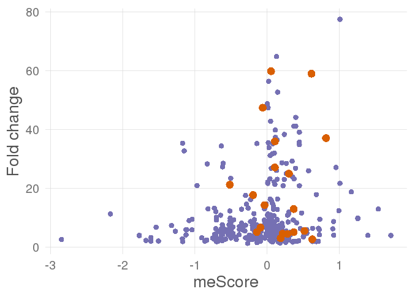

We studied how switches and mutations affect the same features of the genes. In this study, we will consider protein-affecting mutations only. The goal is to find features that might be activated or inactivated in tumor both through mutations and splicing changes.

Make a binomial test to find switched features that are frequently mutated. The expected frequency is the relative size of the feature in the isoform (between 0 and 1); the obtained frequency is the proportion of mutations in the gene that affect that feature.

Analysis per tumor type
-----------------------

``` r
mut_feat_overlap <- read.delim(paste0(wd,"mutation_switch_feature_overlap.txt"), header=TRUE)

pvals <- apply(mut_feat_overlap[,c("MutationsInFeature","TotalMutations","FeatureSize")],1, function(x){ 
  if (x[2]==0){
    p <- 1
  } else {
    p <- binom.test(x[1],x[2],x[3],"greater")
    p <- p$p.value
  }
  p
} )
adjpvalues <- p.adjust(pvals)

mut_feat_overlap$p <- pvals
mut_feat_overlap$adjp <- adjpvalues
mut_feat_overlap <- mut_feat_overlap[order(mut_feat_overlap$p),]

write.table(mut_feat_overlap,paste0(results_filepath,'tables/mutation_switch_feature_overlap_withPVals.txt'),quote=F,col.names=T,sep="\t",row.names=FALSE)
```

| Cancer | Symbol    | What              | Feature                                                           | Driver |      p|   adjp|
|:-------|:----------|:------------------|:------------------------------------------------------------------|:-------|------:|------:|
| luad   | GLG1      | Lost\_in\_tumor   | PS51289-GLG1 C RICH Cysteine-rich GLG1 repeat profile.            | False  |  0.000|  0.000|
| luad   | RAB11FIP4 | Gained\_in\_tumor | PS50222-EF HAND 2 EF-hand calcium-binding domain profile.         | False  |  0.000|  0.006|
| kirc   | ARHGAP5   | Lost\_in\_tumor   | PS51676-FF FF domain profile.                                     | False  |  0.000|  0.020|
| brca   | CHD6      | Lost\_in\_tumor   | PF00385-Chromo (CHRromatin Organisation MOdifier) domain          | False  |  0.000|  0.094|
| luad   | PPP1R9A   | Gained\_in\_tumor | PF00595-PDZ domain (Also known as DHR or GLGF)                    | False  |  0.000|  0.177|
| coad   | ADAMTSL1  | Lost\_in\_tumor   | PS50092-TSP1 Thrombospondin type-1 (TSP1) repeat profile.         | False  |  0.000|  0.238|
| hnsc   | OGT       | Lost\_in\_tumor   | PS50005-TPR TPR repeat profile.                                   | False  |  0.000|  0.380|
| luad   | LATS1     | Lost\_in\_tumor   | PF00069-Protein kinase domain                                     | False  |  0.000|  0.519|
| brca   | APAF1     | Lost\_in\_tumor   | PF00400-WD domain, G-beta repeat                                  | True   |  0.000|  0.602|
| coad   | ADAMTSL1  | Lost\_in\_tumor   | PF00090-Thrombospondin type 1 domain                              | False  |  0.000|  0.612|
| coad   | DUS3L     | Lost\_in\_tumor   | PS50103-ZF C3H1 Zinc finger C3H1-type profile.                    | False  |  0.000|  0.706|
| luad   | KIAA0907  | Lost\_in\_tumor   | PS50099-PRO RICH Proline-rich region profile.                     | False  |  0.000|  0.709|
| luad   | CHD6      | Lost\_in\_tumor   | PF00176-SNF2 family N-terminal domain                             | False  |  0.000|  0.814|
| hnsc   | OGT       | Lost\_in\_tumor   | PF13414-TPR repeat                                                | False  |  0.000|  1.000|
| coad   | TSC22D1   | Gained\_in\_tumor | PS50322-GLN RICH Glutamine-rich region profile.                   | False  |  0.000|  1.000|
| luad   | RTN3      | Gained\_in\_tumor | PS50324-SER RICH Serine-rich region profile.                      | False  |  0.000|  1.000|
| luad   | HECW2     | Gained\_in\_tumor | PS50004-C2 C2 domain profile.                                     | False  |  0.000|  1.000|
| brca   | SPEG      | Lost\_in\_tumor   | PS50099-PRO RICH Proline-rich region profile.                     | False  |  0.000|  1.000|
| kirc   | ZNF644    | Lost\_in\_tumor   | PS50157-ZINC FINGER C2H2 2 Zinc finger C2H2 type domain profile.  | False  |  0.000|  1.000|
| brca   | ABR       | Lost\_in\_tumor   | PF00168-C2 domain                                                 | False  |  0.000|  1.000|
| luad   | PIK3AP1   | Lost\_in\_tumor   | PS51376-DBB DBB domain profile.                                   | False  |  0.000|  1.000|
| luad   | PIK3AP1   | Lost\_in\_tumor   | PF14545-Dof, BCAP, and BANK (DBB) motif,                          | False  |  0.001|  1.000|
| luad   | PRLR      | Gained\_in\_tumor | PF09067-Erythropoietin receptor, ligand binding                   | False  |  0.001|  1.000|
| coad   | CHD6      | Lost\_in\_tumor   | PF00176-SNF2 family N-terminal domain                             | False  |  0.001|  1.000|
| brca   | PREX1     | Lost\_in\_tumor   | PF00610-Domain found in Dishevelled, Egl-10, and Pleckstrin (DEP) | False  |  0.001|  1.000|
| kirc   | SDK1      | Lost\_in\_tumor   | PS50835-IG LIKE Ig-like domain profile.                           | False  |  0.001|  1.000|
| lihc   | PIKFYVE   | Lost\_in\_tumor   | PF01504-Phosphatidylinositol-4-phosphate 5-Kinase                 | False  |  0.001|  1.000|
| kirc   | SETDB1    | Lost\_in\_tumor   | PF05033-Pre-SET motif                                             | True   |  0.001|  1.000|
| brca   | ADAMTSL1  | Lost\_in\_tumor   | PS50092-TSP1 Thrombospondin type-1 (TSP1) repeat profile.         | False  |  0.001|  1.000|
| coad   | TLR4      | Lost\_in\_tumor   | PS51450-LRR Leucine-rich repeat profile.                          | False  |  0.001|  1.000|

*Table. Top 30 more significant cases of overlap between mutations and switches*

Some interesting cases:

-   LATS1: Protein kinase domain

-   ADAMTSL1: Thrombospondins are secreted proteins with antiangiogenic abilities.

-   Some domains related to transcription

> ARHGAP5: The **FF domain** is present in a variety of nuclear transcription and splicing factors, as well as the p190 family of RhoGAPs.

> ZNF644: **Zinc finger (Znf) domains** are relatively small protein motifs which contain multiple finger-like protrusions that make tandem contacts with their target molecule. [...] [T]hey are now recognised to bind DNA, RNA, protein and/or lipid substrates

> APAF1: **WD40-repeat** proteins are a large family found in all eukaryotes and are implicated in a variety of functions ranging from signal transduction and transcription regulation to cell cycle control, autophagy and apoptosis.

Analysis aggregating all tumors
-------------------------------

``` r
mut_feat_overlap_agg <- ddply(mut_feat_overlap,
                              .(Gene,Symbol,Normal_transcript,Tumor_transcript,What,
                                DomainNumber,FeatureType,Feature,Driver,FeatureSize), 
                              summarise, inMut=sum(MutationsInFeature), 
                              totalMut=sum(TotalMutations) )
mut_feat_overlap_agg$Ratio = 100 * mut_feat_overlap_agg$inMut/mut_feat_overlap_agg$totalMut

pvals <- apply(mut_feat_overlap_agg[,c("inMut","totalMut","FeatureSize")],1, function(x){ 
  if (x[2]==0){
    p <- 1
  } else {
    p <- binom.test(x[1],x[2],x[3],"greater")
    p <- p$p.value
  }
  p
} )
adjpvalues <- p.adjust(pvals)

mut_feat_overlap_agg$p_mutation_feature_overlap <- pvals
mut_feat_overlap_agg$adjp_mutation_feature_overlap <- adjpvalues
mut_feat_overlap_agg <- mut_feat_overlap_agg[order(mut_feat_overlap_agg$p_mutation_feature_overlap),]

write.table(mut_feat_overlap_agg,paste0(results_filepath,'tables/mutation_switch_feature_overlap_allCancers_withPVals.txt'),quote=F,col.names=T,sep="\t",row.names=FALSE)
```

    ## Warning: Removed 1179 rows containing missing values (geom_point).


*Figure. Mutations that affect a particular structural feature vs size of that particular feature. In purple, significant cases before multitesting correction; in orange, significant cases after multitesting correction.*

Comparison with meScores
------------------------

There is a big overlap with the previous list regarding the top genes. It will be interesting to check if these mutations tend to appear in the same patients as the switch of in different ones. In order to do that, we will show the meScore for those genes.

| Symbol    | What              | Feature                                                          | Driver |   Score|
|:----------|:------------------|:-----------------------------------------------------------------|:-------|-------:|
| RAD50     | Lost\_in\_tumor   | PF13476-AAA domain                                               | False  |   1.716|
| INPPL1    | Lost\_in\_tumor   | PS50001-SH2 Src homology 2 (SH2) domain profile.                 | True   |   1.542|
| SIPA1L2   | Lost\_in\_tumor   | PF02145-Rap/ran-GAP                                              | False  |   1.396|
| EPS15     | Lost\_in\_tumor   | PS50031-EH EH domain profile.                                    | True   |   1.257|
| EPS15     | Lost\_in\_tumor   | PF12763-Cytoskeletal-regulatory complex EF hand                  | True   |   1.257|
| PRMT10    | Lost\_in\_tumor   | PF07719-Tetratricopeptide repeat                                 | False  |   1.167|
| AMOT      | Lost\_in\_tumor   | PS50316-HIS RICH Histidine-rich region profile.                  | False  |   1.010|
| AMOT      | Lost\_in\_tumor   | PS50322-GLN RICH Glutamine-rich region profile.                  | False  |   1.010|
| ARID4B    | Lost\_in\_tumor   | PF11717-RNA binding activity-knot of a chromodomain              | False  |   0.995|
| ALG13     | Gained\_in\_tumor | PS50304-TUDOR Tudor domain profile.                              | False  |   0.955|
| TDRD7     | Lost\_in\_tumor   | PS51644-HTH OST OST-type HTH domain profile.                     | False  |   0.923|
| TDRD7     | Lost\_in\_tumor   | PF00567-Tudor domain                                             | False  |   0.923|
| MITF      | Lost\_in\_tumor   | PS50322-GLN RICH Glutamine-rich region profile.                  | True   |   0.910|
| MCC       | Gained\_in\_tumor | PS50324-SER RICH Serine-rich region profile.                     | False  |   0.816|
| TBC1D2    | Lost\_in\_tumor   | PS50003-PH DOMAIN PH domain profile.                             | False  |   0.731|
| CNTN4     | Lost\_in\_tumor   | PF07679-Immunoglobulin I-set domain                              | False  |   0.725|
| CNTN4     | Lost\_in\_tumor   | PS50835-IG LIKE Ig-like domain profile.                          | False  |   0.725|
| ZNF841    | Lost\_in\_tumor   | PS50805-KRAB Krueppel-associated box (KRAB) profile.             | False  |   0.713|
| VCAM1     | Lost\_in\_tumor   | PF07679-Immunoglobulin I-set domain                              | False  |   0.711|
| BTBD1     | Lost\_in\_tumor   | PF08005-PHR domain                                               | False  |  -0.700|
| SP140L    | Lost\_in\_tumor   | PF00628-PHD-finger                                               | False  |  -0.701|
| SP140L    | Lost\_in\_tumor   | PS50016-ZF PHD 2 Zinc finger PHD-type profile.                   | False  |  -0.701|
| NCOA7     | Gained\_in\_tumor | PF01476-LysM domain                                              | False  |  -0.708|
| TAF5L     | Lost\_in\_tumor   | PS50082-WD REPEATS 2 Trp-Asp (WD) repeats profile.               | False  |  -0.710|
| TAF5L     | Lost\_in\_tumor   | PS50294-WD REPEATS REGION Trp-Asp (WD) repeats circular profile. | False  |  -0.710|
| TAF5L     | Lost\_in\_tumor   | PF00400-WD domain, G-beta repeat                                 | False  |  -0.710|
| FARP1     | Lost\_in\_tumor   | PS50057-FERM 3 FERM domain profile.                              | False  |  -0.713|
| FARP1     | Lost\_in\_tumor   | PF00169-PH domain                                                | False  |  -0.713|
| HFE       | Lost\_in\_tumor   | PS50835-IG LIKE Ig-like domain profile.                          | False  |  -0.727|
| HFE       | Lost\_in\_tumor   | PF07654-Immunoglobulin C1-set domain                             | False  |  -0.727|
| RAB11FIP3 | Lost\_in\_tumor   | PF13499-EF-hand domain pair                                      | False  |  -0.729|
| FMN1      | Lost\_in\_tumor   | PF02181-Formin Homology 2 Domain                                 | False  |  -0.754|
| LAMA3     | Lost\_in\_tumor   | PS51117-LAMININ NTER Laminin N-terminal domain profile.          | False  |  -0.819|
| ANK3      | Lost\_in\_tumor   | PS50088-ANK REPEAT Ankyrin repeat profile.                       | True   |  -0.828|
| MPZL1     | Lost\_in\_tumor   | PS50835-IG LIKE Ig-like domain profile.                          | False  |  -0.837|
| MPZL1     | Lost\_in\_tumor   | PF07686-Immunoglobulin V-set domain                              | False  |  -0.837|
| TMEM87A   | Lost\_in\_tumor   | PF06814-Lung seven transmembrane receptor                        | False  |  -0.863|
| KIAA0564  | Lost\_in\_tumor   | PF13519-von Willebrand factor type A domain                      | False  |  -0.905|
| COL12A1   | Gained\_in\_tumor | PS50234-VWFA VWFA domain profile.                                | False  |  -0.970|
| SH3PXD2A  | Gained\_in\_tumor | PF00787-PX domain                                                | False  |  -1.039|
| SH3PXD2A  | Gained\_in\_tumor | PS50195-PX PX domain profile.                                    | False  |  -1.039|
| MTMR15    | Lost\_in\_tumor   | PF08774-VRR-NUC domain                                           | False  |  -1.079|
| MTMR15    | Lost\_in\_tumor   | PF08774-VRR-NUC domain                                           | False  |  -1.079|
| AUTS2     | Lost\_in\_tumor   | PF15336-Autism susceptibility gene 2 protein                     | False  |  -1.113|
| CHD2      | Lost\_in\_tumor   | PF00176-SNF2 family N-terminal domain                            | False  |  -1.122|
| RBM28     | Lost\_in\_tumor   | PS50102-RRM Eukaryotic RNA Recognition Motif (RRM) profile.      | False  |  -1.123|
| EHMT2     | Lost\_in\_tumor   | PS50313-GLU RICH Glutamic acid-rich region profile.              | False  |  -1.148|
| INF2      | Lost\_in\_tumor   | PF02181-Formin Homology 2 Domain                                 | False  |  -1.169|
| MIA3      | Lost\_in\_tumor   | PF07653-Variant SH3 domain                                       | False  |  -1.169|
| SNAP23    | Lost\_in\_tumor   | PF00835-SNAP-25 family                                           | False  |  -1.172|
| ZC3HAV1   | Lost\_in\_tumor   | PF00644-Poly(ADP-ribose) polymerase catalytic domain             | False  |  -1.272|
| SQSTM1    | Lost\_in\_tumor   | PF00564-PB1 domain                                               | False  |  -1.324|
| CRYZ      | Lost\_in\_tumor   | PF00107-Zinc-binding dehydrogenase                               | False  |  -1.505|
| THAP4     | Gained\_in\_tumor | PS50950-ZF THAP Zinc finger THAP-type profile                    | False  |  -1.537|
| UNC45A    | Lost\_in\_tumor   | PF11701-Myosin-binding striated muscle assembly central          | False  |  -1.609|
| ANTXR1    | Lost\_in\_tumor   | PF05586-Anthrax receptor C-terminus region                       | False  |  -1.609|
| DENND5B   | Lost\_in\_tumor   | PF02759-RUN domain                                               | False  |  -1.678|
| KCNMA1    | Lost\_in\_tumor   | PF03493-Calcium-activated BK potassium channel alpha subunit     | False  |  -1.769|
| KCNMA1    | Lost\_in\_tumor   | PF00520-Ion transport protein                                    | False  |  -1.769|
| KLF3      | Lost\_in\_tumor   | PS50157-ZINC FINGER C2H2 2 Zinc finger C2H2 type domain profile. | False  |  -2.168|
| CSTF3     | Lost\_in\_tumor   | PF05843-Suppressor of forked protein (Suf)                       | False  |  -2.849|

*Table. Cases with p \< 0.05 for the overlap between mutations and a feature; and an abs(meScore) \> 0.7 (arbitrary threshold).*



*Figure. meScore vs fold-change, measured as the ratio between the proportion of mutations affecting the feature and the expected proportion (relative size of the feature). In purple, significant cases before multitesting correction; in orange, significant cases after multitesting correction.*

It seems that the genes that accumulate most mutations in a splicing gained/lost feature have meScores close to 0. In the case that there are mutations equivalent to splicing alterations (meScore \> 0), they seem to be less concentrated. This suggest that they are more specific, tumorogenic mutations, rather than random alterations.

A non-exhaustive look into the genes with meScore \> 0.7, we find some interesting cases:

-   RAD50: [Component of the MRN complex, which plays a central role in double-strand break (DSB) repair, DNA recombination, maintenance of telomere integrity and meiosis.](http://www.uniprot.org/uniprot/Q92878)

-   SIPA1L2: Signal-Induced Proliferation-Associated 1 Like 2

-   Several drivers: INPPL1,EPS15,MITF

-   EPS15: annotated as driver. Losing an EH domain, a [substrate for the tyrosine kinase activity of the epidermal growth factor receptor](http://www.ncbi.nlm.nih.gov/pubmed/11911876). No I3D interaction is describing any change in this gene.

> To date, several EH-containing and EH-binding proteins have been identified, which establish in the cell a network of protein:protein interactions, defined as the EH network. This network coordinates cellular functions connected with endocytosis, actin remodeling and intracellular transduction of signals.

-   MCC: or Mutated In Colorectal Cancers...should be annotated as driver? ([candidate colorectal tumor suppressor gene that is thought to negatively regulate cell cycle progression](http://www.genecards.org/cgi-bin/carddisp.pl?gene=MCC)). The region might contain several phosphorylation sites.
