-   Specific switches: overlap in features affected by mutations and switches
    -   Analysis per tumor type
    -   Analysis aggregating all tumors
    -   Comparison with meScores
-   General overlap in features affected by mutations and switches
    -   View of the dat
        -   Analysis per tumor type
    -   Analysis aggregating all tumors
    -   Cluster in domain function

    ## Loading required package: grid
    ## Loading required package: quadprog

    ## Warning in dir.create(wd, recursive = T): '/home/hector/SmartAS/Pipeline/
    ## notebook/20151006_mutation_analysis_files/data' already exists

    ## [1] TRUE

    ## [1] TRUE

    ## [1] TRUE

    ## [1] TRUE

    ## [1] TRUE

We studied how switches and mutations affect the same features of the genes. In this study, we will consider protein-affecting mutations only. The goal is to find features that might be activated or inactivated in tumor both through mutations and splicing changes.

Specific switches: overlap in features affected by mutations and switches
=========================================================================

Make a binomial test to find switched features that are frequently mutated. The expected frequency is the relative size of the feature in the isoform (between 0 and 1); the obtained frequency is the proportion of mutations in the gene that affect that feature.

Analysis per tumor type
-----------------------

``` r
mut_feat_overlap <- read.delim(paste0(wd,"mutation_switch_feature_overlap.txt"), header=TRUE)

pvals <- apply(mut_feat_overlap[,c("MutationsInFeature","TotalMutations","FeatureSize")],1, function(x){ 
  if (x[2]==0){
    p <- 1
  } else {
    p <- binom.test(x[1],x[2],x[3],"greater")
    p <- p$p.value
  }
  p
} )
adjpvalues <- p.adjust(pvals)

mut_feat_overlap$p <- pvals
mut_feat_overlap$adjp <- adjpvalues
mut_feat_overlap <- mut_feat_overlap[order(mut_feat_overlap$p),]

write.table(mut_feat_overlap,paste0(results_filepath,'tables/mutation_switch_feature_overlap_withPVals.txt'),quote=F,col.names=T,sep="\t",row.names=FALSE)
```

| Cancer | Symbol    | What              | Feature                                                                   | Driver |      p|   adjp|
|:-------|:----------|:------------------|:--------------------------------------------------------------------------|:-------|------:|------:|
| luad   | GLG1      | Lost\_in\_tumor   | PS51289|GLG1\_C\_RICH\_Cysteine-rich\_GLG1\_repeat\_profile.              | False  |  0.000|  0.000|
| luad   | RAB11FIP4 | Gained\_in\_tumor | PS50222|EF\_HAND\_2\_EF-hand\_calcium-binding\_domain\_profile.           | False  |  0.000|  0.006|
| kirc   | ARHGAP5   | Lost\_in\_tumor   | PS51676|FF\_FF\_domain\_profile.                                          | False  |  0.000|  0.020|
| brca   | CHD6      | Lost\_in\_tumor   | PF00385|Chromo\_(CHRromatin\_Organisation\_MOdifier)\_domain              | False  |  0.000|  0.094|
| luad   | PPP1R9A   | Gained\_in\_tumor | PF00595|PDZ\_domain\_(Also\_known\_as\_DHR\_or\_GLGF)                     | False  |  0.000|  0.177|
| coad   | ADAMTSL1  | Lost\_in\_tumor   | PS50092|TSP1\_Thrombospondin\_type-1\_(TSP1)\_repeat\_profile.            | False  |  0.000|  0.238|
| hnsc   | OGT       | Lost\_in\_tumor   | PS50005|TPR\_TPR\_repeat\_profile.                                        | False  |  0.000|  0.380|
| luad   | LATS1     | Lost\_in\_tumor   | PF00069|Protein\_kinase\_domain                                           | False  |  0.000|  0.519|
| brca   | APAF1     | Lost\_in\_tumor   | PF00400|WD\_domain,\_G-beta\_repeat                                       | True   |  0.000|  0.602|
| coad   | ADAMTSL1  | Lost\_in\_tumor   | PF00090|Thrombospondin\_type\_1\_domain                                   | False  |  0.000|  0.612|
| coad   | DUS3L     | Lost\_in\_tumor   | PS50103|ZF\_C3H1\_Zinc\_finger\_C3H1-type\_profile.                       | False  |  0.000|  0.706|
| luad   | KIAA0907  | Lost\_in\_tumor   | PS50099|PRO\_RICH\_Proline-rich\_region\_profile.                         | False  |  0.000|  0.709|
| luad   | CHD6      | Lost\_in\_tumor   | PF00176|SNF2\_family\_N-terminal\_domain                                  | False  |  0.000|  0.814|
| hnsc   | OGT       | Lost\_in\_tumor   | PF13414|TPR\_repeat                                                       | False  |  0.000|  1.000|
| coad   | TSC22D1   | Gained\_in\_tumor | PS50322|GLN\_RICH\_Glutamine-rich\_region\_profile.                       | False  |  0.000|  1.000|
| luad   | RTN3      | Gained\_in\_tumor | PS50324|SER\_RICH\_Serine-rich\_region\_profile.                          | False  |  0.000|  1.000|
| luad   | HECW2     | Gained\_in\_tumor | PS50004|C2\_C2\_domain\_profile.                                          | False  |  0.000|  1.000|
| brca   | SPEG      | Lost\_in\_tumor   | PS50099|PRO\_RICH\_Proline-rich\_region\_profile.                         | False  |  0.000|  1.000|
| kirc   | ZNF644    | Lost\_in\_tumor   | PS50157|ZINC\_FINGER\_C2H2\_2\_Zinc\_finger\_C2H2\_type\_domain\_profile. | False  |  0.000|  1.000|
| brca   | ABR       | Lost\_in\_tumor   | PF00168|C2\_domain                                                        | False  |  0.000|  1.000|
| luad   | PIK3AP1   | Lost\_in\_tumor   | PS51376|DBB\_DBB\_domain\_profile.                                        | False  |  0.000|  1.000|
| luad   | PIK3AP1   | Lost\_in\_tumor   | PF14545|Dof,\_BCAP,*and\_BANK*(DBB)\_motif,                               | False  |  0.001|  1.000|
| luad   | PRLR      | Gained\_in\_tumor | PF09067|Erythropoietin\_receptor,\_ligand\_binding                        | False  |  0.001|  1.000|
| coad   | CHD6      | Lost\_in\_tumor   | PF00176|SNF2\_family\_N-terminal\_domain                                  | False  |  0.001|  1.000|
| brca   | PREX1     | Lost\_in\_tumor   | PF00610|Domain\_found\_in\_Dishevelled,\_Egl-10,*and\_Pleckstrin*(DEP)    | False  |  0.001|  1.000|
| kirc   | SDK1      | Lost\_in\_tumor   | PS50835|IG\_LIKE\_Ig-like\_domain\_profile.                               | False  |  0.001|  1.000|
| lihc   | PIKFYVE   | Lost\_in\_tumor   | PF01504|Phosphatidylinositol-4-phosphate\_5-Kinase                        | False  |  0.001|  1.000|
| kirc   | SETDB1    | Lost\_in\_tumor   | PF05033|Pre-SET\_motif                                                    | True   |  0.001|  1.000|
| brca   | ADAMTSL1  | Lost\_in\_tumor   | PS50092|TSP1\_Thrombospondin\_type-1\_(TSP1)\_repeat\_profile.            | False  |  0.001|  1.000|
| coad   | TLR4      | Lost\_in\_tumor   | PS51450|LRR\_Leucine-rich\_repeat\_profile.                               | False  |  0.001|  1.000|

Some interesting cases:

-   EGFR, due to the loss of the kinase domain. Also MEGF6.

-   Thrombospondins are secreted proteins with antiangiogenic abilities.

-   Some domains related to transcription

> The **FF domain** is present in a variety of nuclear transcription and splicing factors, as well as the p190 family of RhoGAPs.

> **Zinc finger (Znf) domains** are relatively small protein motifs which contain multiple finger-like protrusions that make tandem contacts with their target molecule. [...] [T]hey are now recognised to bind DNA, RNA, protein and/or lipid substrates

> **WD40-repeat** proteins are a large family found in all eukaryotes and are implicated in a variety of functions ranging from signal transduction and transcription regulation to cell cycle control, autophagy and apoptosis.

Analysis aggregating all tumors
-------------------------------

``` r
mut_feat_overlap_agg <- ddply(mut_feat_overlap,
                              .(Gene,Symbol,Normal_transcript,Tumor_transcript,What,
                                DomainNumber,FeatureType,Feature,Driver,FeatureSize), 
                              summarise, inMut=sum(MutationsInFeature), 
                              totalMut=sum(TotalMutations) )
mut_feat_overlap_agg$Ratio = 100 * mut_feat_overlap_agg$inMut/mut_feat_overlap_agg$totalMut

pvals <- apply(mut_feat_overlap_agg[,c("inMut","totalMut","FeatureSize")],1, function(x){ 
  if (x[2]==0){
    p <- 1
  } else {
    p <- binom.test(x[1],x[2],x[3],"greater")
    p <- p$p.value
  }
  p
} )
adjpvalues <- p.adjust(pvals)

mut_feat_overlap_agg$p_mutation_feature_overlap <- pvals
mut_feat_overlap_agg$adjp_mutation_feature_overlap <- adjpvalues
mut_feat_overlap_agg <- mut_feat_overlap_agg[order(mut_feat_overlap_agg$p_mutation_feature_overlap),]

write.table(mut_feat_overlap_agg,paste0(results_filepath,'tables/mutation_switch_feature_overlap_allCancers_withPVals.txt'),quote=F,col.names=T,sep="\t",row.names=FALSE)
```

    ## Warning: Removed 1179 rows containing missing values (geom_point).

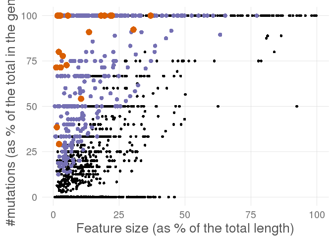

Comparison with meScores
------------------------

There is a big overlap with the previous list regarding the top genes. It will be interesting to check if these mutations tend to appear in the same patients as the switch of in different ones. In order to do that, we will show the meScore for those genes:

| Symbol    | What              | Feature                                                                                            | Driver |   Score|
|:----------|:------------------|:---------------------------------------------------------------------------------------------------|:-------|-------:|
| RAD50     | Lost\_in\_tumor   | PF13476|AAA\_domain                                                                                | False  |   1.716|
| INPPL1    | Lost\_in\_tumor   | PS50001|SH2\_Src\_homology\_2\_(SH2)\_domain\_profile.                                             | True   |   1.542|
| SIPA1L2   | Lost\_in\_tumor   | PF02145|Rap/ran-GAP                                                                                | False  |   1.396|
| EPS15     | Lost\_in\_tumor   | PS50031|EH\_EH\_domain\_profile.                                                                   | True   |   1.257|
| EPS15     | Lost\_in\_tumor   | PF12763|Cytoskeletal-regulatory\_complex\_EF\_hand                                                 | True   |   1.257|
| PRMT10    | Lost\_in\_tumor   | PF07719|Tetratricopeptide\_repeat                                                                  | False  |   1.167|
| AMOT      | Lost\_in\_tumor   | PS50316|HIS\_RICH\_Histidine-rich\_region\_profile.                                                | False  |   1.010|
| AMOT      | Lost\_in\_tumor   | PS50322|GLN\_RICH\_Glutamine-rich\_region\_profile.                                                | False  |   1.010|
| ARID4B    | Lost\_in\_tumor   | PF11717|RNA\_binding\_activity-knot\_of\_a\_chromodomain                                           | False  |   0.995|
| ALG13     | Gained\_in\_tumor | PS50304|TUDOR\_Tudor\_domain\_profile.                                                             | False  |   0.955|
| TDRD7     | Lost\_in\_tumor   | PS51644|HTH\_OST\_OST-type\_HTH\_domain\_profile.                                                  | False  |   0.923|
| TDRD7     | Lost\_in\_tumor   | PF00567|Tudor\_domain                                                                              | False  |   0.923|
| MITF      | Lost\_in\_tumor   | PS50322|GLN\_RICH\_Glutamine-rich\_region\_profile.                                                | True   |   0.910|
| MCC       | Gained\_in\_tumor | PS50324|SER\_RICH\_Serine-rich\_region\_profile.                                                   | False  |   0.816|
| TBC1D2    | Lost\_in\_tumor   | PS50003|PH\_DOMAIN\_PH\_domain\_profile.                                                           | False  |   0.731|
| CNTN4     | Lost\_in\_tumor   | PF07679|Immunoglobulin\_I-set\_domain                                                              | False  |   0.725|
| CNTN4     | Lost\_in\_tumor   | PS50835|IG\_LIKE\_Ig-like\_domain\_profile.                                                        | False  |   0.725|
| ZNF841    | Lost\_in\_tumor   | PS50805|KRAB\_Krueppel-associated\_box\_(KRAB)\_profile.                                           | False  |   0.713|
| VCAM1     | Lost\_in\_tumor   | PF07679|Immunoglobulin\_I-set\_domain                                                              | False  |   0.711|
| TFIP11    | Lost\_in\_tumor   | PF07842|GC-rich\_sequence\_DNA-binding\_factor-like\_protein                                       | False  |   0.683|
| TFIP11    | Lost\_in\_tumor   | PS50174|G\_PATCH\_G-patch\_domain\_profile.                                                        | False  |   0.683|
| OAS2      | Lost\_in\_tumor   | PF10421|2'-5'-oligoadenylate\_synthetase\_1,\_domain\_2,\_C-terminus                               | False  |   0.631|
| OAS2      | Lost\_in\_tumor   | PS50152|25A\_SYNTH\_3\_2'-5'-oligoadenylate\_synthase\_N-terminal\_region\_profile.                | False  |   0.631|
| CD300A    | Lost\_in\_tumor   | PS50835|IG\_LIKE\_Ig-like\_domain\_profile.                                                        | False  |   0.627|
| CD300A    | Lost\_in\_tumor   | PF07686|Immunoglobulin\_V-set\_domain                                                              | False  |   0.627|
| TSC22D1   | Gained\_in\_tumor | PS50322|GLN\_RICH\_Glutamine-rich\_region\_profile.                                                | False  |   0.616|
| CES3      | Lost\_in\_tumor   | PS51257|PROKAR\_LIPOPROTEIN\_Prokaryotic\_membrane\_lipoprotein\_lipid\_attachment\_site\_profile. | False  |   0.576|
| PPP1R16B  | Lost\_in\_tumor   | PF12796|Ankyrin\_repeats\_(3\_copies)                                                              | False  |   0.552|
| PPARD     | Lost\_in\_tumor   | PS51030|NUCLEAR\_REC\_DBD\_2\_Nuclear\_hormone\_receptors\_DNA-binding\_domain\_profile.           | False  |   0.551|
| FGD5      | Lost\_in\_tumor   | PS50313|GLU\_RICH\_Glutamic\_acid-rich\_region\_profile.                                           | False  |   0.519|
| GNB5      | Lost\_in\_tumor   | PS50082|WD\_REPEATS\_2\_Trp-Asp\_(WD)\_repeats\_profile.                                           | False  |   0.510|
| TRIM41    | Gained\_in\_tumor | PF00622|SPRY\_domain                                                                               | False  |   0.502|
| EPN2      | Lost\_in\_tumor   | PS50330|UIM\_Ubiquitin-interacting\_motif\_(UIM)\_domain\_profile.                                 | False  |  -0.500|
| EPN2      | Lost\_in\_tumor   | PF01417|ENTH\_domain                                                                               | False  |  -0.500|
| EPN2      | Lost\_in\_tumor   | PS50942|ENTH\_ENTH\_domain\_profile.                                                               | False  |  -0.500|
| WWC2      | Lost\_in\_tumor   | PS50324|SER\_RICH\_Serine-rich\_region\_profile.                                                   | False  |  -0.502|
| C2        | Lost\_in\_tumor   | PS50923|SUSHI\_Sushi/CCP/SCR\_domain\_profile.                                                     | False  |  -0.509|
| C2        | Lost\_in\_tumor   | PF00084|Sushi\_domain\_(SCR\_repeat)                                                               | False  |  -0.509|
| DST       | Lost\_in\_tumor   | PF00435|Spectrin\_repeat                                                                           | False  |  -0.510|
| ARHGAP5   | Lost\_in\_tumor   | PS51676|FF\_FF\_domain\_profile.                                                                   | False  |  -0.516|
| ARHGAP5   | Lost\_in\_tumor   | PF01846|FF\_domain                                                                                 | False  |  -0.516|
| ARHGAP5   | Lost\_in\_tumor   | PF00071|Ras\_family                                                                                | False  |  -0.516|
| ADAMTSL4  | Lost\_in\_tumor   | PF00090|Thrombospondin\_type\_1\_domain                                                            | False  |  -0.526|
| SGEF      | Lost\_in\_tumor   | PF00018|SH3\_domain                                                                                | False  |  -0.528|
| ZFAND1    | Lost\_in\_tumor   | PS51039|ZF\_AN1\_Zinc\_finger\_AN1-type\_profile.                                                  | False  |  -0.528|
| HIRIP3    | Lost\_in\_tumor   | PS50313|GLU\_RICH\_Glutamic\_acid-rich\_region\_profile.                                           | False  |  -0.541|
| NR1H2     | Lost\_in\_tumor   | PS51030|NUCLEAR\_REC\_DBD\_2\_Nuclear\_hormone\_receptors\_DNA-binding\_domain\_profile.           | True   |  -0.557|
| PTPRJ     | Lost\_in\_tumor   | PF00102|Protein-tyrosine\_phosphatase                                                              | False  |  -0.573|
| FAIM3     | Lost\_in\_tumor   | PF00047|Immunoglobulin\_domain                                                                     | False  |  -0.604|
| IQCB1     | Lost\_in\_tumor   | PF00612|IQ\_calmodulin-binding\_motif                                                              | False  |  -0.606|
| ALCAM     | Lost\_in\_tumor   | PS50835|IG\_LIKE\_Ig-like\_domain\_profile.                                                        | False  |  -0.612|
| ARHGAP5   | Lost\_in\_tumor   | PS51676|FF\_FF\_domain\_profile.                                                                   | False  |  -0.616|
| IRF6      | Lost\_in\_tumor   | PS51507|IRF\_2\_IRF\_tryptophan\_pentad\_repeat\_DNA-binding\_domain\_profile.                     | True   |  -0.616|
| CDC23     | Lost\_in\_tumor   | PS50293|TPR\_REGION\_TPR\_repeat\_region\_circular\_profile.                                       | False  |  -0.619|
| BRF1      | Lost\_in\_tumor   | PF00382|Transcription\_factor\_TFIIB\_repeat                                                       | False  |  -0.619|
| PIKFYVE   | Lost\_in\_tumor   | PF01504|Phosphatidylinositol-4-phosphate\_5-Kinase                                                 | False  |  -0.631|
| PIKFYVE   | Lost\_in\_tumor   | PS50178|ZF\_FYVE\_Zinc\_finger\_FYVE/FYVE-related\_type\_profile.                                  | False  |  -0.631|
| PIKFYVE   | Lost\_in\_tumor   | PF00118|TCP-1/cpn60\_chaperonin\_family                                                            | False  |  -0.631|
| DNAJC7    | Lost\_in\_tumor   | PS50005|TPR\_TPR\_repeat\_profile.                                                                 | False  |  -0.635|
| HACE1     | Lost\_in\_tumor   | PS50297|ANK\_REP\_REGION\_Ankyrin\_repeat\_region\_circular\_profile.                              | False  |  -0.637|
| CYTSA     | Lost\_in\_tumor   | PF00307|Calponin\_homology\_(CH)\_domain                                                           | False  |  -0.645|
| NR2F2     | Lost\_in\_tumor   | PF00105|Zinc\_finger,*C4\_type*(two\_domains)                                                      | False  |  -0.663|
| NR2F2     | Lost\_in\_tumor   | PS51030|NUCLEAR\_REC\_DBD\_2\_Nuclear\_hormone\_receptors\_DNA-binding\_domain\_profile.           | False  |  -0.663|
| SETDB1    | Lost\_in\_tumor   | PF00856|SET\_domain                                                                                | True   |  -0.678|
| RABGAP1L  | Lost\_in\_tumor   | PF00566|Rab-GTPase-TBC\_domain                                                                     | False  |  -0.689|
| BTBD1     | Lost\_in\_tumor   | PF08005|PHR\_domain                                                                                | False  |  -0.700|
| SP140L    | Lost\_in\_tumor   | PF00628|PHD-finger                                                                                 | False  |  -0.701|
| SP140L    | Lost\_in\_tumor   | PS50016|ZF\_PHD\_2\_Zinc\_finger\_PHD-type\_profile.                                               | False  |  -0.701|
| NCOA7     | Gained\_in\_tumor | PF01476|LysM\_domain                                                                               | False  |  -0.708|
| TAF5L     | Lost\_in\_tumor   | PS50082|WD\_REPEATS\_2\_Trp-Asp\_(WD)\_repeats\_profile.                                           | False  |  -0.710|
| TAF5L     | Lost\_in\_tumor   | PS50294|WD\_REPEATS\_REGION\_Trp-Asp\_(WD)\_repeats\_circular\_profile.                            | False  |  -0.710|
| TAF5L     | Lost\_in\_tumor   | PF00400|WD\_domain,\_G-beta\_repeat                                                                | False  |  -0.710|
| FARP1     | Lost\_in\_tumor   | PS50057|FERM\_3\_FERM\_domain\_profile.                                                            | False  |  -0.713|
| FARP1     | Lost\_in\_tumor   | PF00169|PH\_domain                                                                                 | False  |  -0.713|
| HFE       | Lost\_in\_tumor   | PS50835|IG\_LIKE\_Ig-like\_domain\_profile.                                                        | False  |  -0.727|
| HFE       | Lost\_in\_tumor   | PF07654|Immunoglobulin\_C1-set\_domain                                                             | False  |  -0.727|
| RAB11FIP3 | Lost\_in\_tumor   | PF13499|EF-hand\_domain\_pair                                                                      | False  |  -0.729|
| FMN1      | Lost\_in\_tumor   | PF02181|Formin\_Homology\_2\_Domain                                                                | False  |  -0.754|
| LAMA3     | Lost\_in\_tumor   | PS51117|LAMININ\_NTER\_Laminin\_N-terminal\_domain\_profile.                                       | False  |  -0.819|
| ANK3      | Lost\_in\_tumor   | PS50088|ANK\_REPEAT\_Ankyrin\_repeat\_profile.                                                     | True   |  -0.828|
| MPZL1     | Lost\_in\_tumor   | PS50835|IG\_LIKE\_Ig-like\_domain\_profile.                                                        | False  |  -0.837|
| MPZL1     | Lost\_in\_tumor   | PF07686|Immunoglobulin\_V-set\_domain                                                              | False  |  -0.837|
| TMEM87A   | Lost\_in\_tumor   | PF06814|Lung\_seven\_transmembrane\_receptor                                                       | False  |  -0.863|
| KIAA0564  | Lost\_in\_tumor   | PF13519|von\_Willebrand\_factor\_type\_A\_domain                                                   | False  |  -0.905|
| COL12A1   | Gained\_in\_tumor | PS50234|VWFA\_VWFA\_domain\_profile.                                                               | False  |  -0.970|
| SH3PXD2A  | Gained\_in\_tumor | PF00787|PX\_domain                                                                                 | False  |  -1.039|
| SH3PXD2A  | Gained\_in\_tumor | PS50195|PX\_PX\_domain\_profile.                                                                   | False  |  -1.039|
| MTMR15    | Lost\_in\_tumor   | PF08774|VRR-NUC\_domain                                                                            | False  |  -1.079|
| MTMR15    | Lost\_in\_tumor   | PF08774|VRR-NUC\_domain                                                                            | False  |  -1.079|
| AUTS2     | Lost\_in\_tumor   | PF15336|Autism\_susceptibility\_gene\_2\_protein                                                   | False  |  -1.113|
| CHD2      | Lost\_in\_tumor   | PF00176|SNF2\_family\_N-terminal\_domain                                                           | False  |  -1.122|
| RBM28     | Lost\_in\_tumor   | PS50102|RRM\_Eukaryotic\_RNA\_Recognition\_Motif\_(RRM)\_profile.                                  | False  |  -1.123|
| EHMT2     | Lost\_in\_tumor   | PS50313|GLU\_RICH\_Glutamic\_acid-rich\_region\_profile.                                           | False  |  -1.148|
| INF2      | Lost\_in\_tumor   | PF02181|Formin\_Homology\_2\_Domain                                                                | False  |  -1.169|
| MIA3      | Lost\_in\_tumor   | PF07653|Variant\_SH3\_domain                                                                       | False  |  -1.169|
| SNAP23    | Lost\_in\_tumor   | PF00835|SNAP-25\_family                                                                            | False  |  -1.172|
| ZC3HAV1   | Lost\_in\_tumor   | PF00644|Poly(ADP-ribose)\_polymerase\_catalytic\_domain                                            | False  |  -1.272|
| SQSTM1    | Lost\_in\_tumor   | PF00564|PB1\_domain                                                                                | False  |  -1.324|
| CRYZ      | Lost\_in\_tumor   | PF00107|Zinc-binding\_dehydrogenase                                                                | False  |  -1.505|
| THAP4     | Gained\_in\_tumor | PS50950|ZF\_THAP\_Zinc\_finger\_THAP-type\_profile                                                 | False  |  -1.537|
| UNC45A    | Lost\_in\_tumor   | PF11701|Myosin-binding\_striated\_muscle\_assembly\_central                                        | False  |  -1.609|
| ANTXR1    | Lost\_in\_tumor   | PF05586|Anthrax\_receptor\_C-terminus\_region                                                      | False  |  -1.609|
| DENND5B   | Lost\_in\_tumor   | PF02759|RUN\_domain                                                                                | False  |  -1.678|
| KCNMA1    | Lost\_in\_tumor   | PF03493|Calcium-activated\_BK\_potassium\_channel\_alpha\_subunit                                  | False  |  -1.769|
| KCNMA1    | Lost\_in\_tumor   | PF00520|Ion\_transport\_protein                                                                    | False  |  -1.769|
| KLF3      | Lost\_in\_tumor   | PS50157|ZINC\_FINGER\_C2H2\_2\_Zinc\_finger\_C2H2\_type\_domain\_profile.                          | False  |  -2.168|
| CSTF3     | Lost\_in\_tumor   | PF05843|Suppressor\_of\_forked\_protein\_(Suf)                                                     | False  |  -2.849|


It seems that the genes that accumulate most mutations in a splicing gained/lost feature have meScores close to 0. In the case that there are mutations equivalent to splicing alterations (meScore \> 0), they seem to be less concentrated. This suggest that they are more specific, tumorogenic mutations, rather than random alterations.

Looking more in detail to the genes with meScre \> 0.7, we find:

-   EPS15: annotated as driver. Losing an EH domain, a [substrate for the tyrosine kinase activity of the epidermal growth factor receptor](http://www.ncbi.nlm.nih.gov/pubmed/11911876).

> To date, several EH-containing and EH-binding proteins have been identified, which establish in the cell a network of protein:protein interactions, defined as the EH network. This network coordinates cellular functions connected with endocytosis, actin remodeling and intracellular transduction of signals.

No I3D interaction is describing any change in this gene.

-   TDRD7
-   MCC: or Mutated In Colorectal Cancers...should be annotated as driver? ([candidate colorectal tumor suppressor gene that is thought to negatively regulate cell cycle progression](http://www.genecards.org/cgi-bin/carddisp.pl?gene=MCC)). The region might contain several phosphorylation sites.
-   CNTN4

General overlap in features affected by mutations and switches
==============================================================

We look for structural features that are frequently mutated and we compare them to the structural features that are usually switched. The interest is to look for splicing changes that are equivalent to mutation changes. We use the following parameters: \* Mutation frequency: proportion of all the functional mutations that affect one particular feature. Measured taking into account only the features in the most abundant isoform of each gene. \* Switch frequency: sum of all the patients that, per switch, have a feature affected. \* Domain frequency: frequency of a feature in the proteome, counting the features in the most abundant isoform for each gene. Used to normalize the previous quantities.

We annotated the domains relatively highly mutated and highly switched (highly meaning \> quantile 95).

View of the dat
---------------

### Analysis per tumor type

``` r
feat_enrich <- read.delim(paste0(wd,'feature_enrichment.txt'), header=TRUE)
feat_enrich$MutFreq <- feat_enrich$MutIn/feat_enrich$AllMuts
feat_enrich$SwitchFreq <- feat_enrich$SwitchesIn/feat_enrich$AllSwitches
feat_enrich$DomainFrequency <- feat_enrich$DomainCount/feat_enrich$AllDomains
feat_enrich <- feat_enrich[feat_enrich$DomainFrequency != 0,]

for (cancer in cancerTypes){
  
  cat(paste0(cancer,"\n"))
  cancer.feat_enrich <- feat_enrich[feat_enrich$Cancer==cancer,]
  
  # plot normalized mutation frequency and switched frequency
  minMut <- quantile(cancer.feat_enrich$MutFreq/cancer.feat_enrich$DomainFrequency,0.95)
  minSwitch <- quantile(cancer.feat_enrich$SwitchFreq/cancer.feat_enrich$DomainFrequency,0.95)
  
  # plot raw data
  r <- cor(cancer.feat_enrich$MutFreq/cancer.feat_enrich$DomainFrequency,
           cancer.feat_enrich$SwitchFreq/cancer.feat_enrich$DomainFrequency)
  
  p <- ggplot(cancer.feat_enrich,aes(MutFreq/DomainFrequency,SwitchFreq/DomainFrequency)) + 
    geom_point() + 
    geom_point(data=subset(cancer.feat_enrich, MutFreq/DomainFrequency > minMut & SwitchFreq/DomainFrequency > minSwitch),aes(MutFreq/DomainFrequency,SwitchFreq/DomainFrequency,color=Domain)) + 
    smartas_theme() + 
    geom_smooth(method=lm) + 
    geom_text(x=20,y=100,label=paste0("R = ",round(r,2)))
  p <- direct.label(p)
  
  print(p)  
}
```

    ## brca

    ## Loading required package: proto


    ## coad

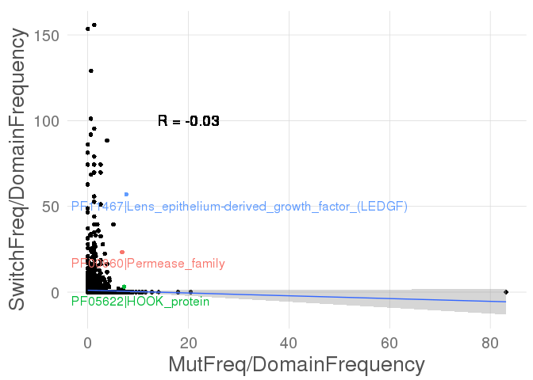

    ## hnsc

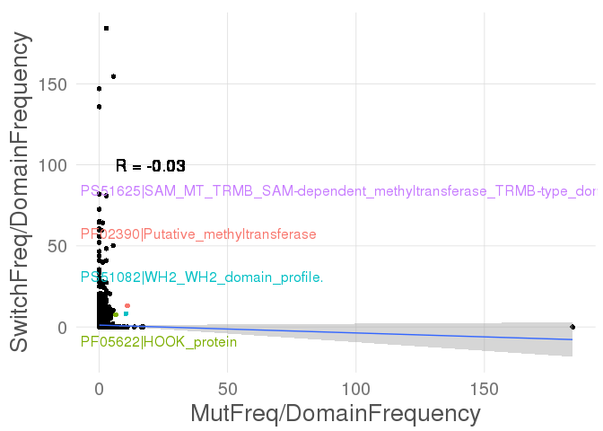

    ## kich

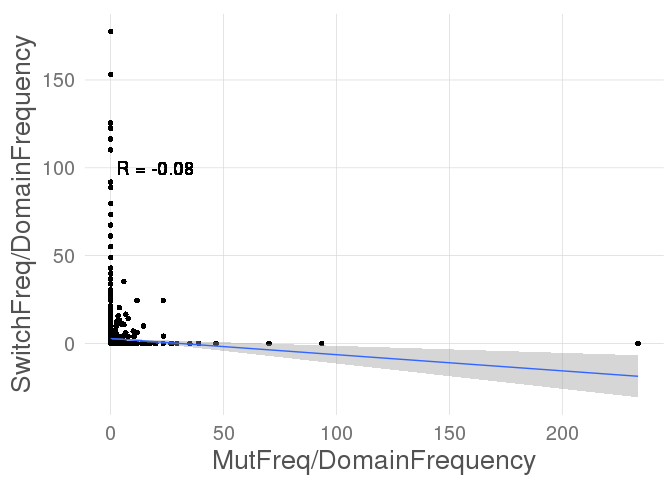

    ## kirc

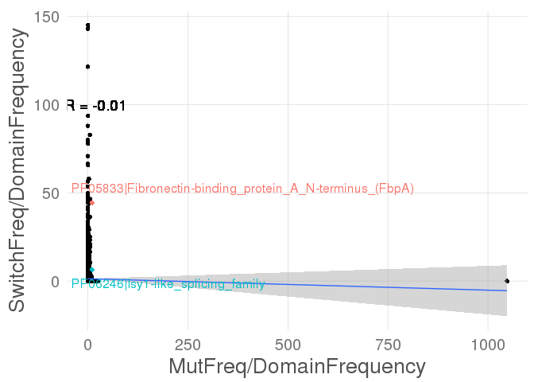

    ## kirp

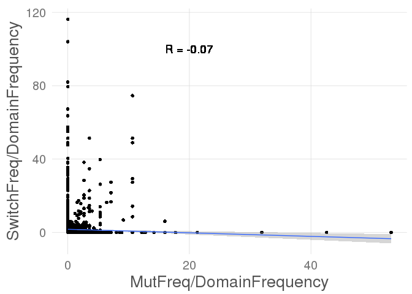

    ## lihc

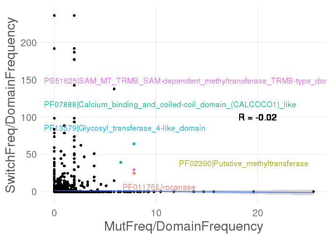

    ## luad

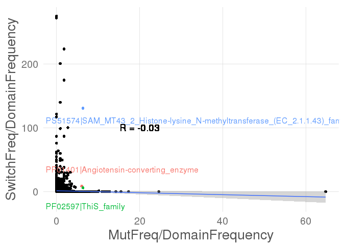

    ## lusc


    ## prad


    ## thca

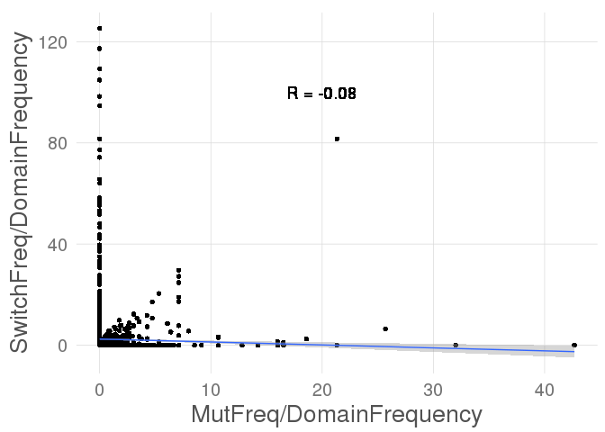

The non-logarithmic scale leads to think that usually changes achieved by splicing are not achieved by mutations and viceversa. Still, there are some outlier domains that are a bit outside the L-shape, suggesting that some features can either be affected by any mechanism. To find out about those, we remove the features that have 0 on either SwitchFreq or MutFreq.

``` r
  # plot log representations and remove those that have 0 on either side
for (cancer in cancerTypes){
  
  cat(paste0(cancer,"\n"))
  cancer.feat_enrich <- feat_enrich[feat_enrich$Cancer==cancer,]
  
  # plot normalized mutation frequency and switched frequency
  minMut <- quantile(cancer.feat_enrich$MutFreq/cancer.feat_enrich$DomainFrequency,0.95)
  minSwitch <- quantile(cancer.feat_enrich$SwitchFreq/cancer.feat_enrich$DomainFrequency,0.95)

  # filter data and get correlation
  r.df <- subset(cancer.feat_enrich, MutFreq != 0 & SwitchFreq != 0)
  r <- cor(r.df$MutFreq/r.df$DomainFrequency,r.df$SwitchFreq/r.df$DomainFrequency)
  
  p <- ggplot(r.df,aes(MutFreq/DomainFrequency,SwitchFreq/DomainFrequency)) + 
    geom_point() + 
    geom_point(data=subset(r.df, MutFreq/DomainFrequency > minMut & SwitchFreq/DomainFrequency > minSwitch),aes(MutFreq/DomainFrequency,SwitchFreq/DomainFrequency,color=Domain)) + 
    smartas_theme() + 
    geom_smooth(method=lm) + 
    geom_text(x=6,y=20,label=paste0("R = ",round(r,2)))
  p <- direct.label(p)
  
  print(p)
  
}
```

    ## brca

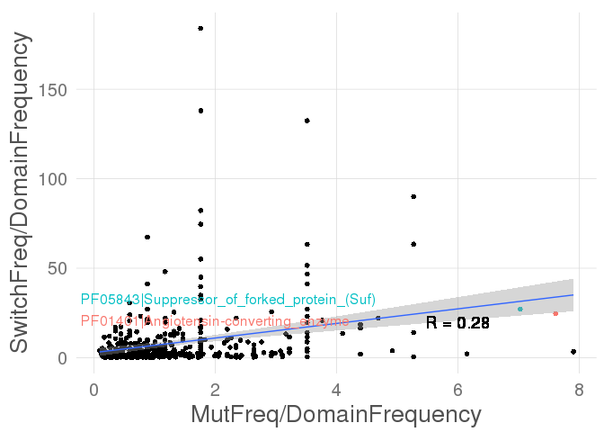

    ## coad

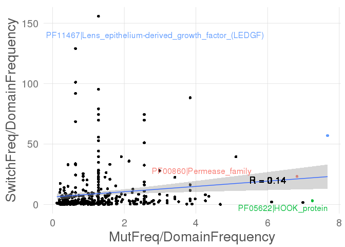

    ## hnsc

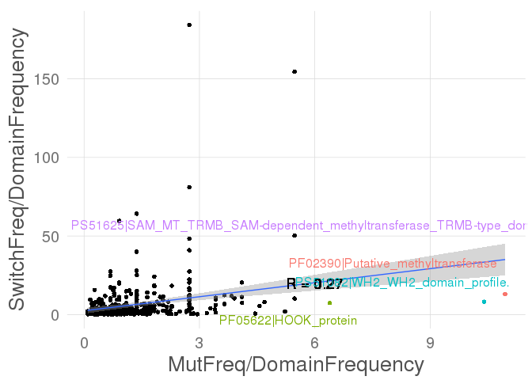

    ## kich

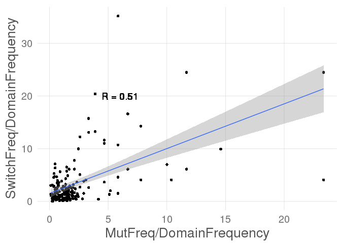

    ## kirc


    ## kirp

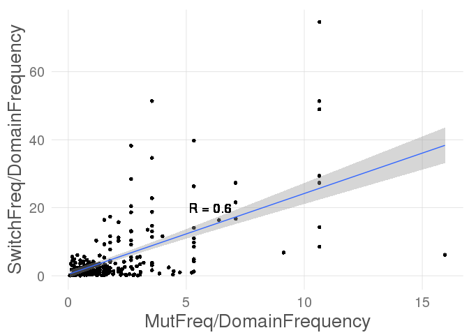

    ## lihc

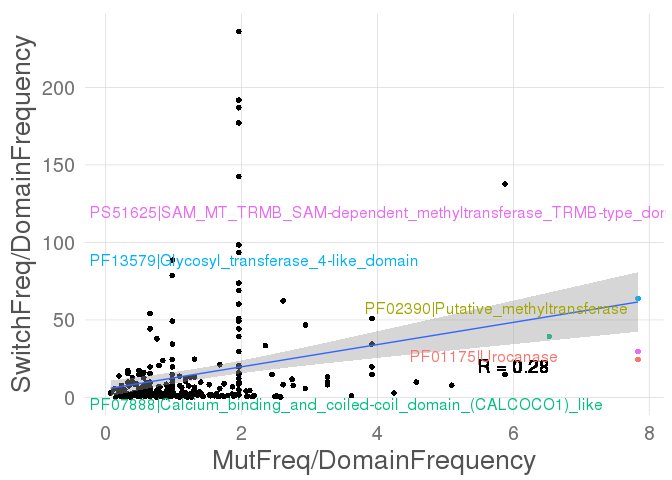

    ## luad

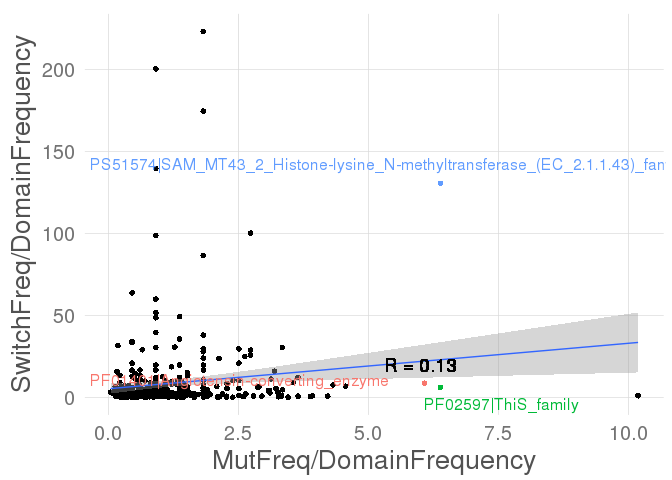

    ## lusc


    ## prad

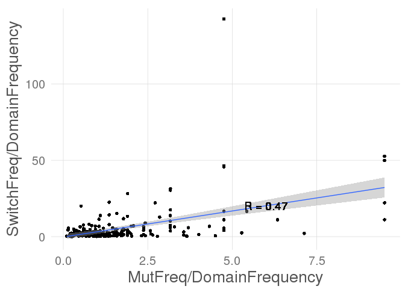

    ## thca

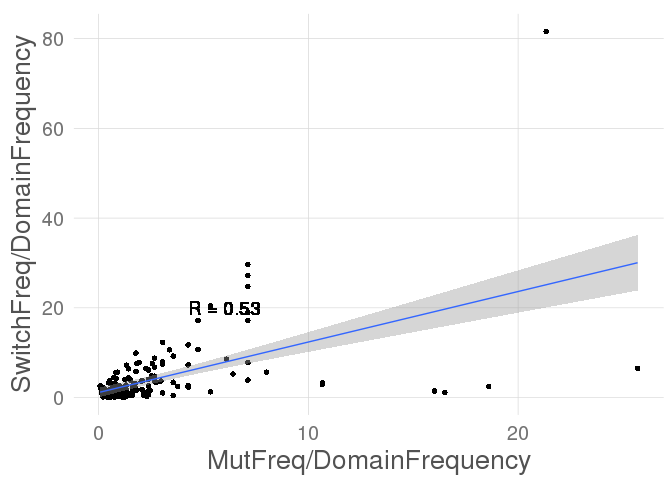

Not only some correlation appears, but some domains that appear to be interesting are among the most highest mutated and switched.

Analysis aggregating all tumors
-------------------------------

We apply the same process to aggregated data from all tumors.

``` r
feat_enrich_agg <- ddply(feat_enrich,.(Domain), summarise, 
                        MutIn=sum(MutIn), AllMuts=sum(AllMuts),
                        SwitchesIn=sum(SwitchesIn), AllSwitches=sum(AllSwitches),
                        DomainCount=sum(DomainCount),AllDomains=sum(AllDomains))
feat_enrich_agg$MutFreq <- feat_enrich_agg$MutIn/feat_enrich_agg$AllMuts
feat_enrich_agg$SwitchFreq <- feat_enrich_agg$SwitchesIn/feat_enrich_agg$AllSwitches
feat_enrich_agg$DomainFrequency <- feat_enrich_agg$DomainCount/feat_enrich_agg$AllDomains

minMut <- quantile(feat_enrich_agg$MutFreq/feat_enrich_agg$DomainFrequency,0.95)
minSwitch <- quantile(feat_enrich_agg$SwitchFreq/feat_enrich_agg$DomainFrequency,0.95)

# plot original data
r <- cor(feat_enrich_agg$MutFreq/feat_enrich_agg$DomainFrequency,
         feat_enrich_agg$SwitchFreq/feat_enrich_agg$DomainFrequency)

p <- ggplot(data=feat_enrich_agg,
            aes(MutFreq/DomainFrequency,SwitchFreq/DomainFrequency)) + 
  geom_point() + 
  geom_point(data=subset(feat_enrich_agg,
                         MutFreq/DomainFrequency > minMut & 
                         SwitchFreq/DomainFrequency > minSwitch),
             aes(MutFreq/DomainFrequency,
                 SwitchFreq/DomainFrequency,
                 color=Domain)) + 
  smartas_theme() + 
  geom_smooth(method=lm) + 
  geom_text(x=20,y=100,label=paste0("R = ",round(r,2)))
p <- direct.label(p)

p
```

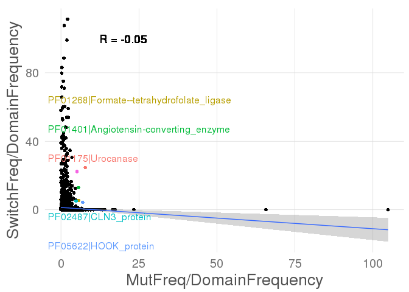

``` r
# plot log2 representations and remove those that have 0 on either side
r.df <- subset(feat_enrich_agg, MutFreq != 0 & SwitchFreq != 0)
r <- cor(r.df$MutFreq/r.df$DomainFrequency,r.df$SwitchFreq/r.df$DomainFrequency)

p <- ggplot(data=r.df,aes(MutFreq/DomainFrequency,SwitchFreq/DomainFrequency)) + 
  geom_point() + 
  geom_point(data=subset(r.df,MutFreq/DomainFrequency > minMut & 
                         SwitchFreq/DomainFrequency > minSwitch),
             aes(MutFreq/DomainFrequency,SwitchFreq/DomainFrequency,color=Domain)) + 
  smartas_theme() + 
  geom_smooth(method=lm) + 
  geom_text(x=6,y=20,label=paste0("R = ",round(r,2)))
p <- direct.label(p)

p
```

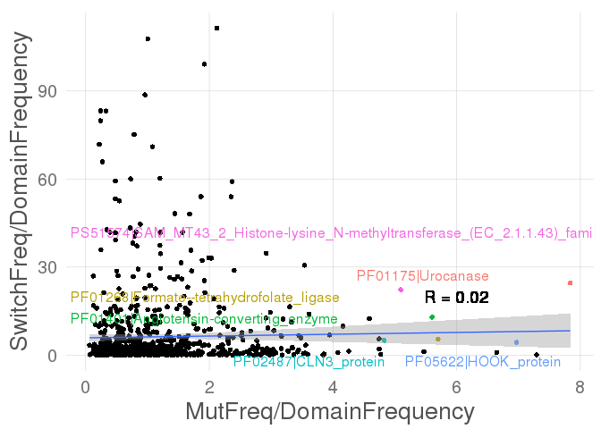

Similar results appear, but the correlation is quite lost, suggesting that the domains that need to be affected in each cancer type are tumor specific.

Cluster in domain function
--------------------------

We wanted to know if the correlation improves if we aggregate the domains by function affected. So, maybe if domains that are only affected by mutations or by switches actually share some functions.

The frequencies are calculated as the quotient between the "in" counts (mutations in the feature, switches affecting the feature, of number of times that feature is observed in the proteome) and the total number of counts.

``` r
# read GO termns
prosite_annotation <- read.delim(paste0(wd,"prosite2go.clean.txt"),row.names = NULL,header=F)
pfam_annotation <- read.delim(paste0(wd,"Pfam2go.clean.txt"),row.names = NULL,header=F)

annotation <- rbind(prosite_annotation,pfam_annotation)
colnames(annotation) <- c("id","GO")

# remove the GO prefix from all of them  
z <- gsub(";GO:[[:digit:]]+", "", annotation$GO)
z <- gsub("^GO:", "", z)
z <- paste0(toupper(substring(z, 1,1)),substring(z, 2))
  
annotation$GO <- z

# get the interpro id for the domains
feat_enrich_agg$id <- unlist(strsplit(as.character(feat_enrich_agg$Domain),"|",fixed = T))[c(T,F)]

# merge the two tables. if a domain has several annotations, if will appear several times
feat_enrich_agg <- merge(feat_enrich_agg,annotation,all.x=T)

# aggregate by GO term and calculate the frequencies
feat_function_aggregated <- ddply(feat_enrich_agg,.(GO),summarise,MutIn=sum(MutIn),AllMuts = sum(AllMuts), SwitchesIn = sum(SwitchesIn), AllSwitches = sum(AllSwitches), DomainCount=sum(DomainCount),AllDomains=sum(AllDomains))

feat_function_aggregated$MutFreq <- feat_function_aggregated$MutIn/feat_function_aggregated$AllMuts
feat_function_aggregated$SwitchFreq <- feat_function_aggregated$SwitchesIn/feat_function_aggregated$AllSwitches
feat_function_aggregated$GOFrequency <- feat_function_aggregated$DomainCount/feat_function_aggregated$AllDomains
```

``` r
# plot original data
r <- cor(feat_function_aggregated$MutFreq/feat_function_aggregated$GOFrequency,feat_function_aggregated$SwitchFreq/feat_function_aggregated$GOFrequency)

p <- ggplot(data=feat_function_aggregated,aes(MutFreq/GOFrequency,SwitchFreq/GOFrequency)) + 
  geom_point() + 
  smartas_theme() + 
  geom_smooth(method=lm) + 
  geom_text(x=20,y=20,label=paste0("R = ",round(r,2)))

p
```

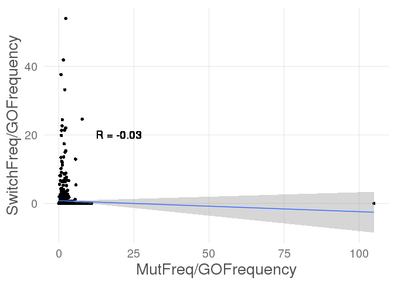

Same as before, there seems to be a mutual exclusion between functions affected by mutations and functions affected by alternative splicing.

``` r
r.df <- subset(feat_function_aggregated, SwitchFreq != 0 & MutFreq != 0)
r <- cor(r.df$MutFreq/r.df$GOFrequency,r.df$SwitchFreq/r.df$GOFrequency)

# show the extreme values
minMut <- quantile(r.df$MutFreq/r.df$GOFrequency,0.95)
minSwitch <- quantile(r.df$SwitchFreq/r.df$GOFrequency,0.95)

p <- ggplot(data=r.df,aes(MutFreq/GOFrequency,SwitchFreq/GOFrequency)) + 
  geom_point() + 
  geom_point(data=subset(r.df,MutFreq/GOFrequency > minMut & 
                         SwitchFreq/GOFrequency > minSwitch),
             aes(MutFreq/GOFrequency,SwitchFreq/GOFrequency,color=GO)) +
  smartas_theme() + 
  geom_smooth(method=lm) + 
  geom_text(x=6,y=20,label=paste0("R = ",round(r,2)))
p <- direct.label(p)

p
```

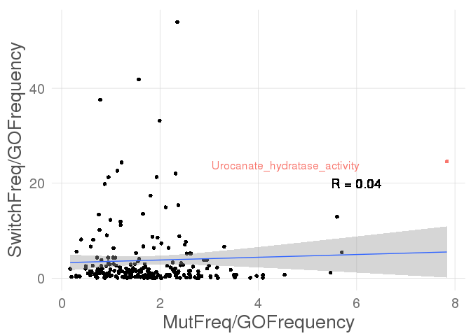

Removing the cases with perfect mutual exclusion only stresses the L-shape of the distribution. Only the urocanate metabolism stands out, same as in previous analyses. This amino acid is part of the degradation of the histidine, and any relation to cancer progression is not evident.
