We look for structural features that are frequently mutated and we compare them to the structural features that are usually switched. The interest is to look for splicing changes that are equivalent to mutation changes. We use the following parameters:

-   Mutation frequency: proportion of all the functional mutations that affect one particular feature. Measured taking into account only the features in the most abundant isoform of each gene.

-   Switch frequency: sum of all the patients that, per switch, have a feature affected.

-   Domain frequency: frequency of a feature in the proteome, counting the features in the most abundant isoform for each gene. Used to normalize the previous quantities.

We annotated the domains relatively highly mutated and highly switched (highly meaning \> quantile 95).

Analysis per tumor type
-----------------------

``` r
feat_enrich <- read.delim(paste0(wd,'feature_enrichment.txt'), header=TRUE)
feat_enrich$MutFreq <- feat_enrich$MutIn/feat_enrich$AllMuts
feat_enrich$SwitchFreq <- feat_enrich$SwitchesIn/feat_enrich$AllSwitches
feat_enrich$DomainFrequency <- feat_enrich$DomainCount/feat_enrich$AllDomains
feat_enrich <- feat_enrich[feat_enrich$DomainFrequency != 0,]

for (cancer in cancerTypes){
  
  cat(paste0(cancer,"\n"))
  cancer.feat_enrich <- feat_enrich[feat_enrich$Cancer==cancer,]
  
  # plot normalized mutation frequency and switched frequency
  minMut <- quantile(cancer.feat_enrich$MutFreq/cancer.feat_enrich$DomainFrequency,0.95)
  minSwitch <- quantile(cancer.feat_enrich$SwitchFreq/cancer.feat_enrich$DomainFrequency,0.95)
  
  # plot raw data
  r <- cor(cancer.feat_enrich$MutFreq/cancer.feat_enrich$DomainFrequency,
           cancer.feat_enrich$SwitchFreq/cancer.feat_enrich$DomainFrequency)
  
  p <- ggplot(cancer.feat_enrich,aes(MutFreq/DomainFrequency,SwitchFreq/DomainFrequency)) + 
    geom_point() + 
    geom_point(data=subset(cancer.feat_enrich, MutFreq/DomainFrequency > minMut & SwitchFreq/DomainFrequency > minSwitch),aes(MutFreq/DomainFrequency,SwitchFreq/DomainFrequency,color=Domain)) + 
    smartas_theme() + 
    geom_smooth(method=lm) + 
    geom_text(x=20,y=100,label=paste0("R = ",round(r,2)))
  p <- direct.label(p)
  
  print(p)  
}
```

    ## brca

    ## Loading required package: proto

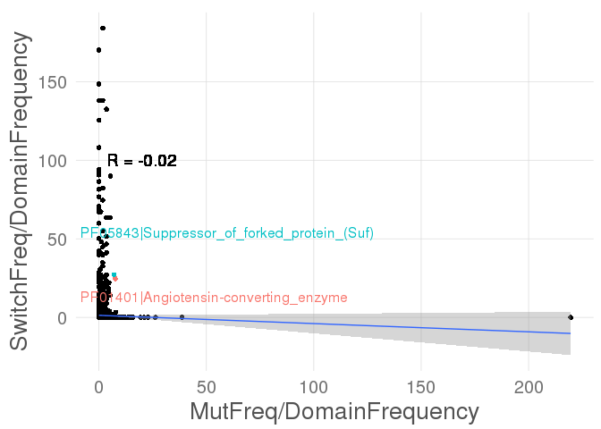

    ## coad

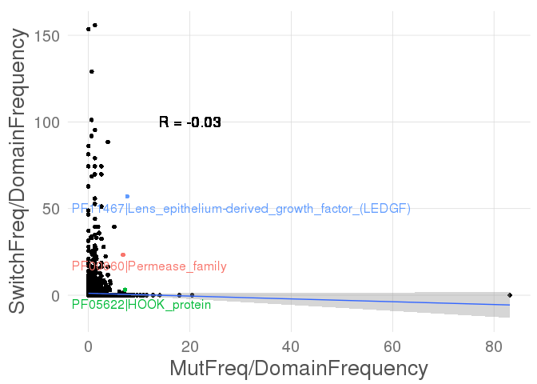

    ## hnsc

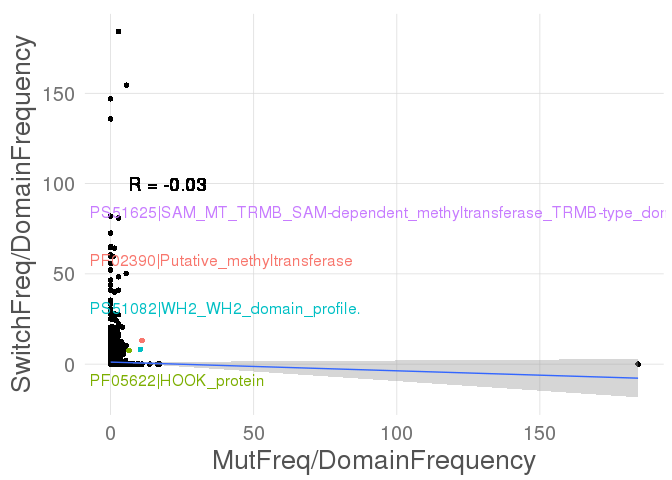

    ## kich


    ## kirc

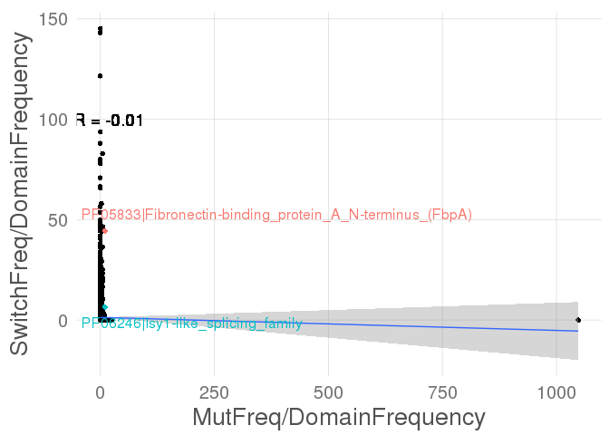

    ## kirp

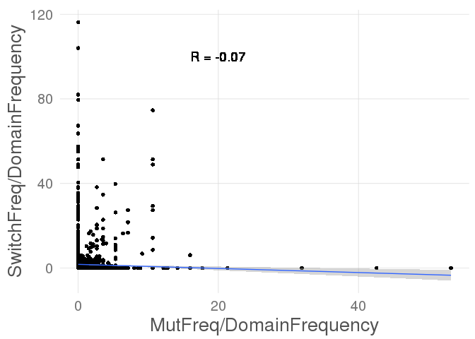

    ## lihc

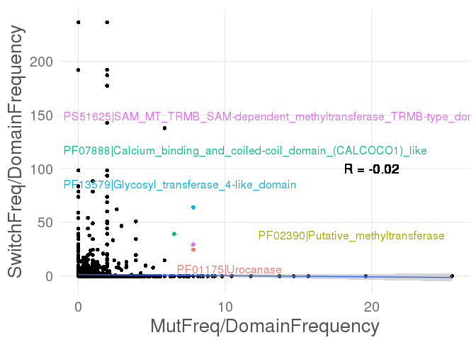

    ## luad


    ## lusc

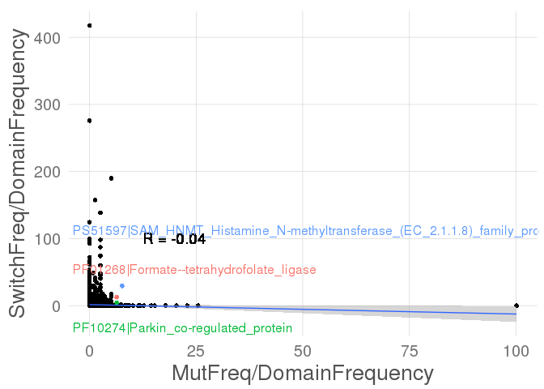

    ## prad

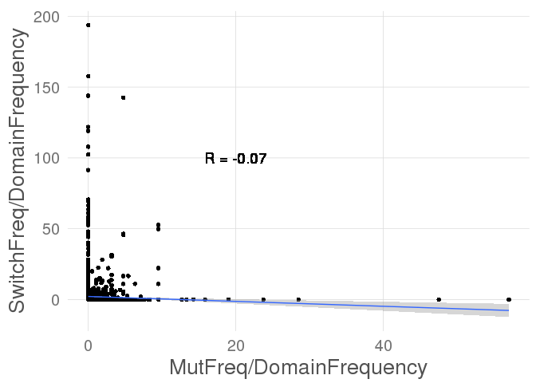

    ## thca

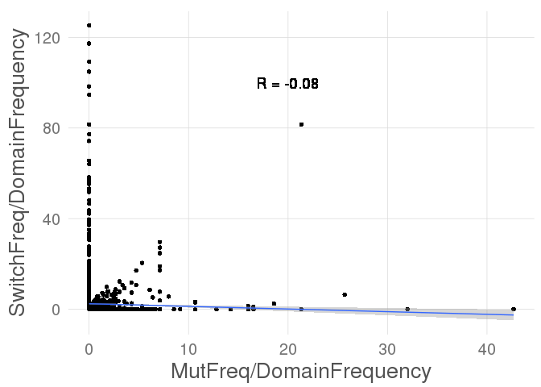

These plots leads to think that usually changes achieved by splicing are not achieved by mutations and viceversa. Still, there are some outlier domains that are a bit outside the L-shape, suggesting that some features can either be affected by any mechanism. To find out about those, we remove the features that have 0 on either SwitchFreq or MutFreq.

``` r
# plot log representations and remove those that have 0 on either side
for (cancer in cancerTypes){
  
  cat(paste0(cancer,"\n"))
  cancer.feat_enrich <- feat_enrich[feat_enrich$Cancer==cancer,]
  
  # plot normalized mutation frequency and switched frequency
  minMut <- quantile(cancer.feat_enrich$MutFreq/cancer.feat_enrich$DomainFrequency,0.95)
  minSwitch <- quantile(cancer.feat_enrich$SwitchFreq/cancer.feat_enrich$DomainFrequency,0.95)

  # filter data and get correlation
  r.df <- subset(cancer.feat_enrich, MutFreq != 0 & SwitchFreq != 0)
  r <- cor(r.df$MutFreq/r.df$DomainFrequency,r.df$SwitchFreq/r.df$DomainFrequency)
  
  p <- ggplot(r.df,aes(MutFreq/DomainFrequency,SwitchFreq/DomainFrequency)) + 
    geom_point() + 
    geom_point(data=subset(r.df, MutFreq/DomainFrequency > minMut & SwitchFreq/DomainFrequency > minSwitch),aes(MutFreq/DomainFrequency,SwitchFreq/DomainFrequency,color=Domain)) + 
    smartas_theme() + 
    geom_smooth(method=lm) + 
    geom_text(x=6,y=20,label=paste0("R = ",round(r,2)))
  p <- direct.label(p)
  
  print(p)
  
}
```

    ## brca

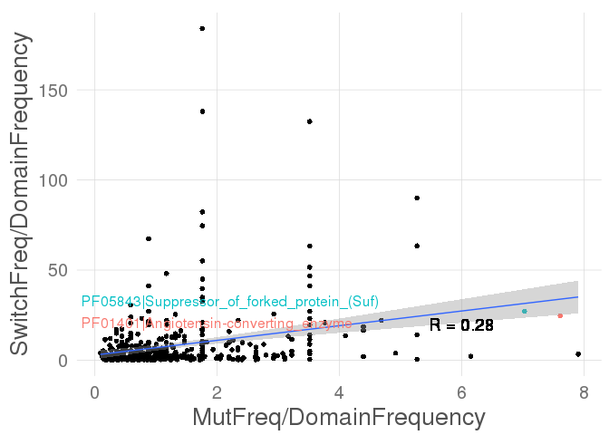

    ## coad

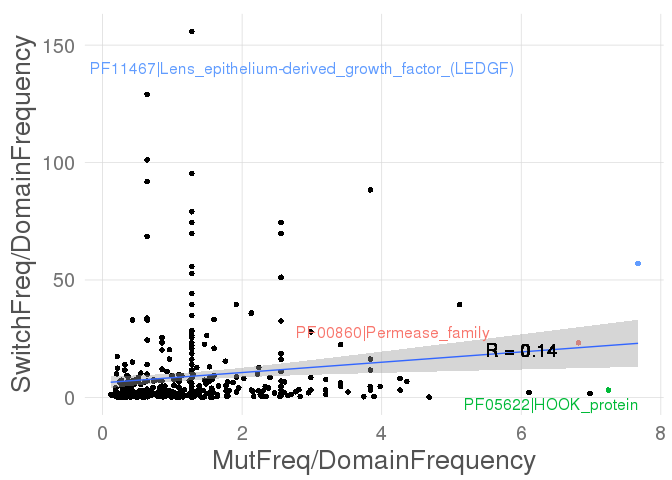

    ## hnsc

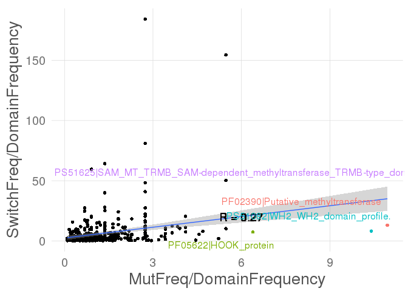

    ## kich

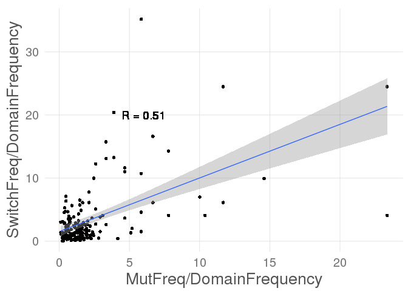

    ## kirc

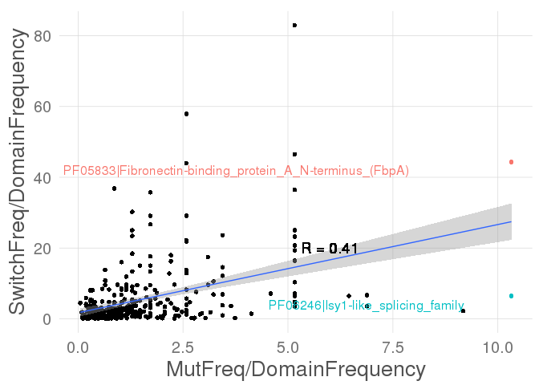

    ## kirp


    ## lihc


    ## luad


    ## lusc

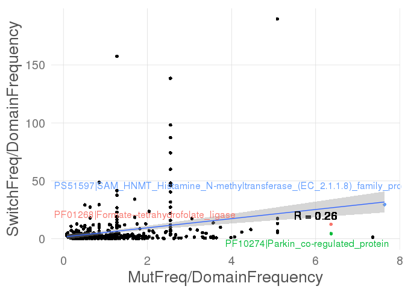

    ## prad

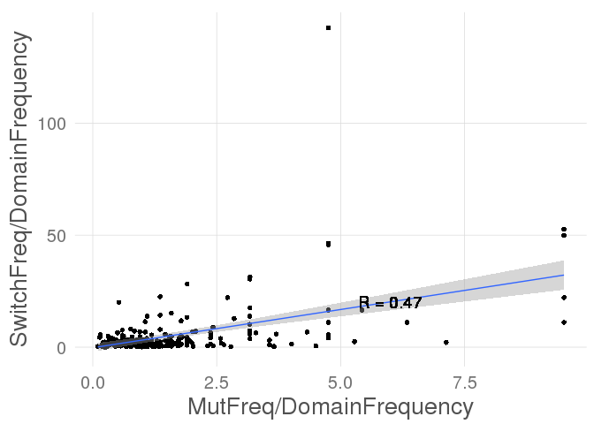

    ## thca


Some degree of correlation appears, particularly in the kidney tumors (kich,kirc,kirp).

Analysis aggregating all tumors
-------------------------------

We apply the same process to aggregated data from all tumors.

``` r
feat_enrich_agg <- ddply(feat_enrich,.(Domain), summarise, 
                        MutIn=sum(MutIn), AllMuts=sum(AllMuts),
                        SwitchesIn=sum(SwitchesIn), AllSwitches=sum(AllSwitches),
                        DomainCount=sum(DomainCount),AllDomains=sum(AllDomains))
feat_enrich_agg$MutFreq <- feat_enrich_agg$MutIn/feat_enrich_agg$AllMuts
feat_enrich_agg$SwitchFreq <- feat_enrich_agg$SwitchesIn/feat_enrich_agg$AllSwitches
feat_enrich_agg$DomainFrequency <- feat_enrich_agg$DomainCount/feat_enrich_agg$AllDomains

minMut <- quantile(feat_enrich_agg$MutFreq/feat_enrich_agg$DomainFrequency,0.95)
minSwitch <- quantile(feat_enrich_agg$SwitchFreq/feat_enrich_agg$DomainFrequency,0.95)

# plot original data
r <- cor(feat_enrich_agg$MutFreq/feat_enrich_agg$DomainFrequency,
         feat_enrich_agg$SwitchFreq/feat_enrich_agg$DomainFrequency)

p <- ggplot(data=feat_enrich_agg,
            aes(MutFreq/DomainFrequency,SwitchFreq/DomainFrequency)) + 
  geom_point() + 
  geom_point(data=subset(feat_enrich_agg,
                         MutFreq/DomainFrequency > minMut & 
                         SwitchFreq/DomainFrequency > minSwitch),
             aes(MutFreq/DomainFrequency,
                 SwitchFreq/DomainFrequency,
                 color=Domain)) + 
  smartas_theme() + 
  geom_smooth(method=lm) + 
  geom_text(x=20,y=100,label=paste0("R = ",round(r,2)))
p <- direct.label(p)

p
```

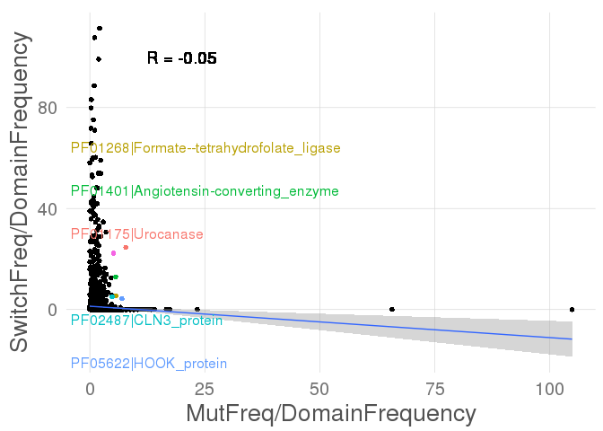

``` r
# plot log2 representations and remove those that have 0 on either side
r.df <- subset(feat_enrich_agg, MutFreq != 0 & SwitchFreq != 0)
r <- cor(r.df$MutFreq/r.df$DomainFrequency,r.df$SwitchFreq/r.df$DomainFrequency)

p <- ggplot(data=r.df,aes(MutFreq/DomainFrequency,SwitchFreq/DomainFrequency)) + 
  geom_point() + 
  geom_point(data=subset(r.df,MutFreq/DomainFrequency > minMut & 
                         SwitchFreq/DomainFrequency > minSwitch),
             aes(MutFreq/DomainFrequency,SwitchFreq/DomainFrequency,color=Domain)) + 
  smartas_theme() + 
  geom_smooth(method=lm) + 
  geom_text(x=6,y=20,label=paste0("R = ",round(r,2)))
p <- direct.label(p)

p
```

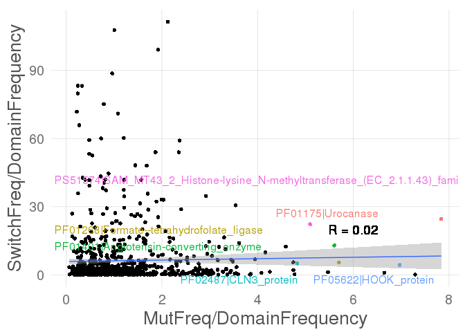

Similar results appear, but the correlation is non-existant, suggesting that the domains that need to be affected in each cancer type are tumor specific.

Clustering by domain function
-----------------------------

We wanted to know if the correlation improves if we aggregate the domains by function affected. So, maybe if domains that are only affected by mutations or by switches actually share some functions.

The frequencies are calculated as the quotient between the "in" counts (mutations in the feature, switches affecting the feature, of number of times that feature is observed in the proteome) and the total number of counts.

``` r
# read GO termns
prosite_annotation <- read.delim(paste0(wd,"prosite2go.clean.txt"),row.names = NULL,header=F)
pfam_annotation <- read.delim(paste0(wd,"Pfam2go.clean.txt"),row.names = NULL,header=F)

annotation <- rbind(prosite_annotation,pfam_annotation)
colnames(annotation) <- c("id","GO")

# remove the GO prefix from all of them  
z <- gsub(";GO:[[:digit:]]+", "", annotation$GO)
z <- gsub("^GO:", "", z)
z <- paste0(toupper(substring(z, 1,1)),substring(z, 2))
  
annotation$GO <- z

# get the interpro id for the domains
feat_enrich_agg$id <- unlist(strsplit(as.character(feat_enrich_agg$Domain),"|",fixed = T))[c(T,F)]

# merge the two tables. if a domain has several annotations, if will appear several times
feat_enrich_agg <- merge(feat_enrich_agg,annotation,all.x=T)

# aggregate by GO term and calculate the frequencies
feat_function_aggregated <- ddply(feat_enrich_agg,.(GO),summarise,MutIn=sum(MutIn),AllMuts = sum(AllMuts), SwitchesIn = sum(SwitchesIn), AllSwitches = sum(AllSwitches), DomainCount=sum(DomainCount),AllDomains=sum(AllDomains))

feat_function_aggregated$MutFreq <- feat_function_aggregated$MutIn/feat_function_aggregated$AllMuts
feat_function_aggregated$SwitchFreq <- feat_function_aggregated$SwitchesIn/feat_function_aggregated$AllSwitches
feat_function_aggregated$GOFrequency <- feat_function_aggregated$DomainCount/feat_function_aggregated$AllDomains
```

``` r
# plot original data
r <- cor(feat_function_aggregated$MutFreq/feat_function_aggregated$GOFrequency,feat_function_aggregated$SwitchFreq/feat_function_aggregated$GOFrequency)

p <- ggplot(data=feat_function_aggregated,aes(MutFreq/GOFrequency,SwitchFreq/GOFrequency)) + 
  geom_point() + 
  smartas_theme() + 
  geom_smooth(method=lm) + 
  geom_text(x=20,y=20,label=paste0("R = ",round(r,2)))

p
```

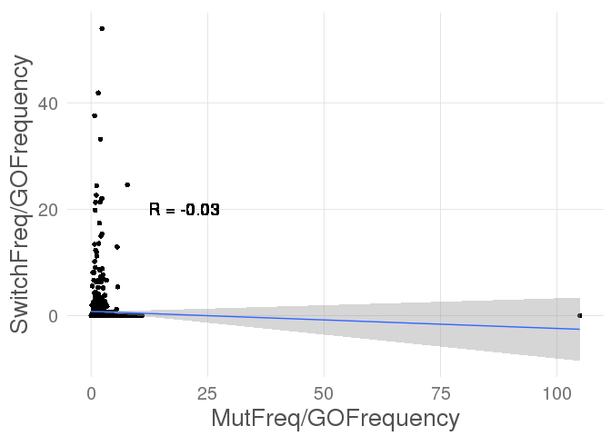

Same as before, there seems to be a mutual exclusion between functions affected by mutations and functions affected by alternative splicing.

``` r
r.df <- subset(feat_function_aggregated, SwitchFreq != 0 & MutFreq != 0)
r <- cor(r.df$MutFreq/r.df$GOFrequency,r.df$SwitchFreq/r.df$GOFrequency)

# show the extreme values
minMut <- quantile(r.df$MutFreq/r.df$GOFrequency,0.95)
minSwitch <- quantile(r.df$SwitchFreq/r.df$GOFrequency,0.95)

p <- ggplot(data=r.df,aes(MutFreq/GOFrequency,SwitchFreq/GOFrequency)) + 
  geom_point() + 
  geom_point(data=subset(r.df,MutFreq/GOFrequency > minMut & 
                         SwitchFreq/GOFrequency > minSwitch),
             aes(MutFreq/GOFrequency,SwitchFreq/GOFrequency,color=GO)) +
  smartas_theme() + 
  geom_smooth(method=lm) + 
  geom_text(x=6,y=20,label=paste0("R = ",round(r,2)))
p <- direct.label(p)

p
```

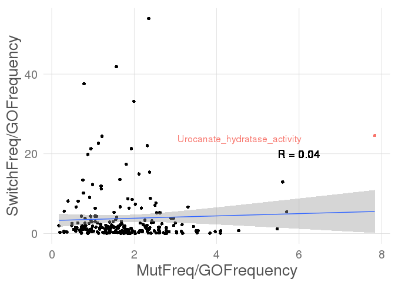

Removing the cases with perfect mutual exclusion only stresses the L-shape of the distribution. Only the urocanate metabolism stands out, same as in previous analyses. This amino acid is part of the degradation of the histidine, and any relation to cancer progression is not evident.

Further study on mutual exclusion
---------------------------------

The L-shaped plots, might mean there is a mutual exclusion between features affected by mutations and alternative splicing. However, it may be just an illusion due to the outliers that reduce the resolution. So we make the same plot removing the outliers, outlier meaning points more extreme than quantile 95 in either axis.

``` r
for (cancer in cancerTypes){
  
  cat(paste0(cancer,"\n"))
  cancer.feat_enrich <- feat_enrich[feat_enrich$Cancer==cancer,]
  
  # plot normalized mutation frequency and switched frequency
  mutOutliers <- quantile(cancer.feat_enrich$MutFreq/cancer.feat_enrich$DomainFrequency,0.95)
  switchOutliers <- quantile(cancer.feat_enrich$SwitchFreq/cancer.feat_enrich$DomainFrequency,0.95)
  
  # remove outliers
  cancer.feat_enrich <- cancer.feat_enrich[cancer.feat_enrich$MutFreq/cancer.feat_enrich$DomainFrequency <= mutOutliers,]
  cancer.feat_enrich <- cancer.feat_enrich[cancer.feat_enrich$SwitchFreq/cancer.feat_enrich$DomainFrequency <= switchOutliers,]
  
  # plot raw data
  r <- cor(cancer.feat_enrich$MutFreq/cancer.feat_enrich$DomainFrequency,
           cancer.feat_enrich$SwitchFreq/cancer.feat_enrich$DomainFrequency)
  
  p <- ggplot(cancer.feat_enrich,aes(MutFreq/DomainFrequency,SwitchFreq/DomainFrequency)) + 
    geom_point() + 
    smartas_theme() + 
    geom_smooth(method=lm) + 
    geom_text(x=4,y=3,label=paste0("R = ",round(r,2)))
  
  print(p)

}
```

    ## brca

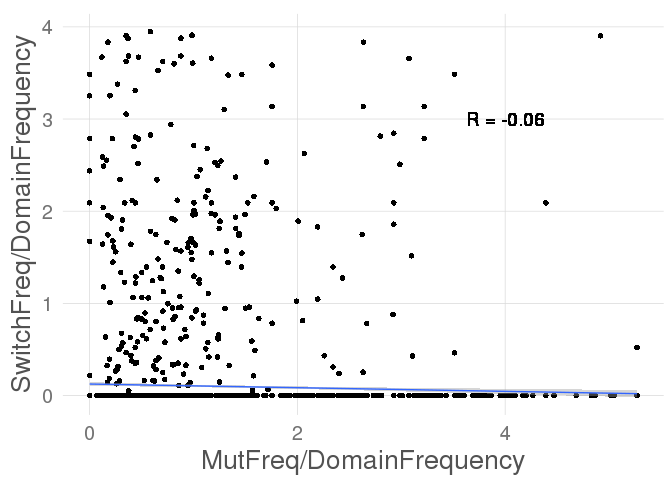

    ## coad

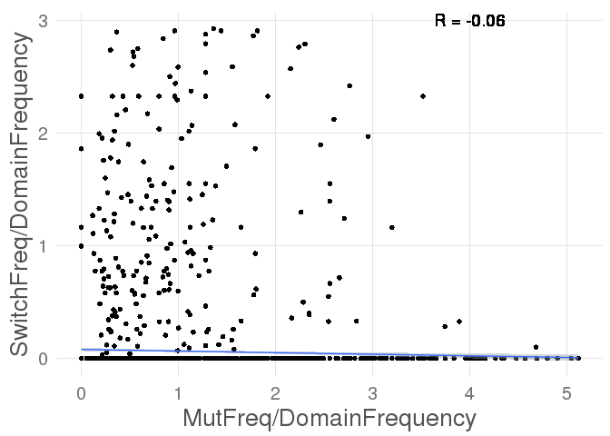

    ## hnsc

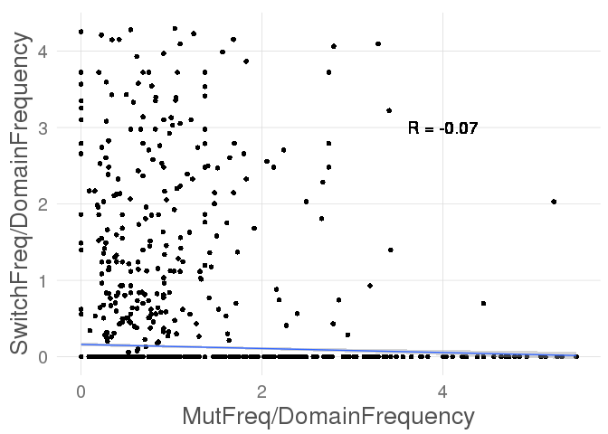

    ## kich

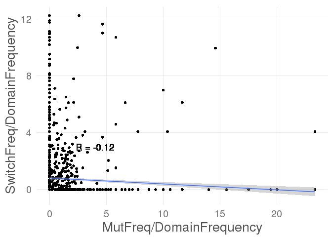

    ## kirc

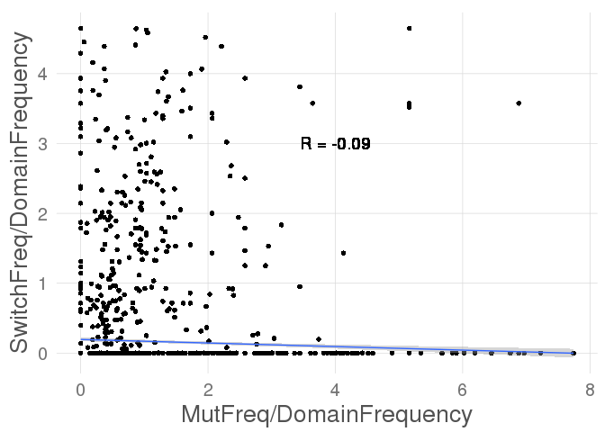

    ## kirp

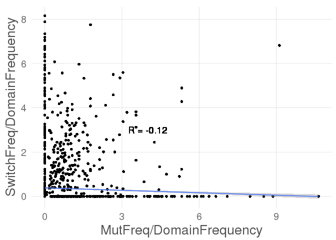

    ## lihc

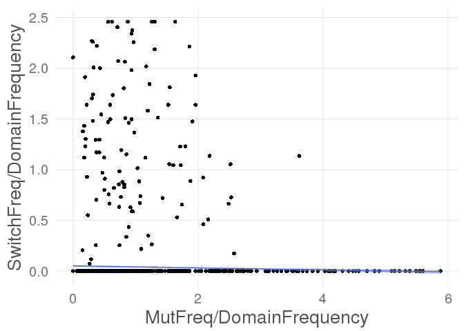

    ## luad

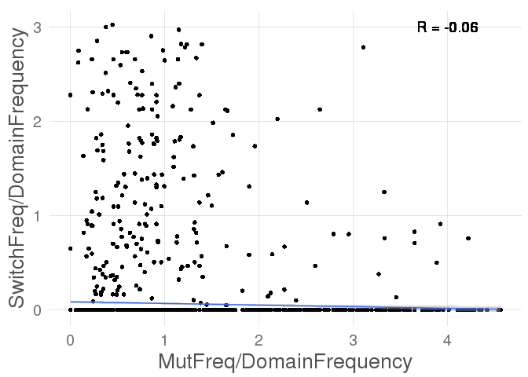

    ## lusc

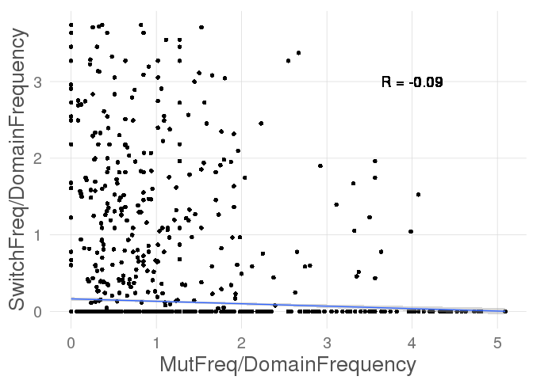

    ## prad

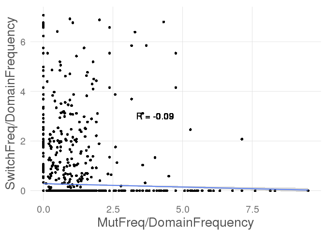

    ## thca

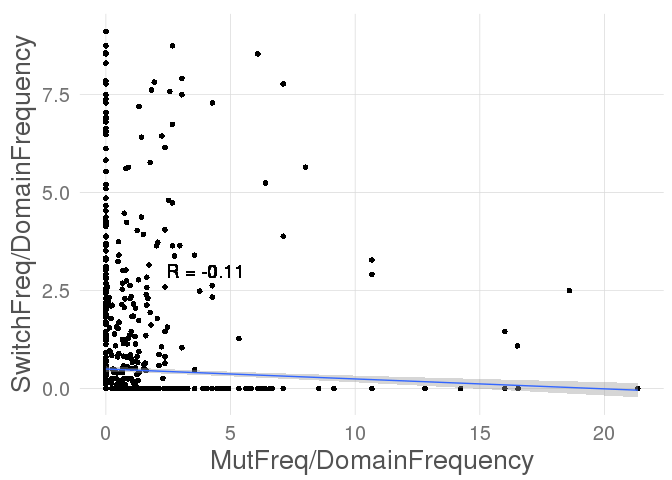

The L-shape seems kept in all the tumor types, reaffirming the mutual exclusion.

Binomial test between frequency of alterations and frequency of feature
-----------------------------------------------------------------------

In order to see if there is any feature enriched in mutations in general, as we do for individual switches, we want to check if any kind of domain is frequently mutated/switched more than expected.

Below are plotted the with an adjusted p-value in either mutations or switches \< 0.05, and a frequency higher than 0 in both axis. Also, the top 10 domains ordered by mutation enrichment p-value.

``` r
for (cancer in cancerTypes){
  
  cat(paste0(cancer,"\n\n"))
  cancer.feat_enrich <- feat_enrich[feat_enrich$Cancer==cancer,]
  
  # binomial tests to mutation affection and switch affection
  cancer.feat_enrich$p_mut <- apply(cancer.feat_enrich[,c("MutIn","AllMuts","DomainFrequency")],1, function(x){ 
    p <- binom.test(x[1],x[2],x[3],"greater")
    p$p.value
  } )
  cancer.feat_enrich$adjp_mut <- p.adjust(cancer.feat_enrich$p_mut)
  
  cancer.feat_enrich$p_swt <- apply(cancer.feat_enrich[,c("SwitchesIn","AllSwitches","DomainFrequency")],1, function(x){ 
    p <- binom.test(x[1],x[2],x[3],"greater")
    p$p.value
  } )
  cancer.feat_enrich$adjp_swt <- p.adjust(cancer.feat_enrich$p_swt)
  
  # plot domains that are enriched either by mutation affection or by switch affection
  cancer.feat_enrich <- cancer.feat_enrich[cancer.feat_enrich$adjp_swt < 0.05 | cancer.feat_enrich$adjp_mut < 0.05,]
  
  cancer.feat_enrich <- subset(cancer.feat_enrich, MutFreq != 0 & SwitchFreq != 0)
  
  r <- cor(cancer.feat_enrich$MutFreq/cancer.feat_enrich$DomainFrequency,
         cancer.feat_enrich$SwitchFreq/cancer.feat_enrich$DomainFrequency)
  
  p <- ggplot(cancer.feat_enrich,aes(MutFreq/DomainFrequency,SwitchFreq/DomainFrequency)) + 
    geom_point() + 
    smartas_theme() + 
    geom_smooth(method=lm) + 
    geom_text(x=4,y=50,label=paste0("R = ",round(r,2)))
  
  print(p)
  cat("\n")
  
  # show top 10 domains affected by mutations
  df <- cancer.feat_enrich[order(cancer.feat_enrich$p_mut),c("Domain","adjp_mut","adjp_swt")]
  df <- df[df$adjp_swt < 0.05,]

  df$Domain <- gsub("|"," - ",df$Domain,fixed = T)
  df$Domain <- gsub("_"," ",df$Domain,fixed = T)

  print(kable(head(df,n = 10),row.names = F, digits=3))
  cat("\n")
  
}
```

brca

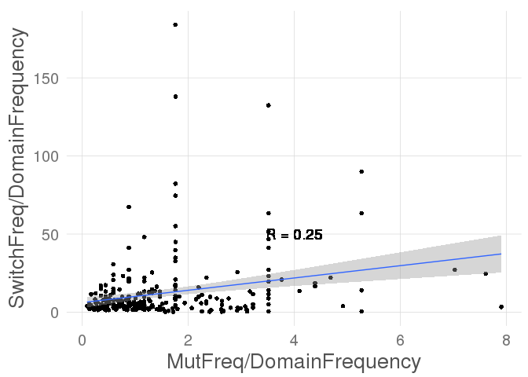

| Domain                                                       |  adjp\_mut|  adjp\_swt|
|:-------------------------------------------------------------|----------:|----------:|
| PF00520 - Ion transport protein                              |      0.000|      0.000|
| PS50057 - FERM 3 FERM domain profile.                        |      0.000|      0.000|
| PF05622 - HOOK protein                                       |      0.000|      0.042|
| PF00664 - ABC transporter transmembrane region               |      0.000|      0.000|
| PF00176 - SNF2 family N-terminal domain                      |      0.000|      0.000|
| PS51420 - RHO small GTPase Rho family profile.               |      0.000|      0.000|
| PF01401 - Angiotensin-converting enzyme                      |      0.000|      0.000|
| PF00930 - Dipeptidyl peptidase IV (DPP IV) N-terminal region |      0.008|      0.000|
| PF00155 - Aminotransferase class I and II                    |      0.014|      0.000|
| PF01044 - Vinculin family                                    |      0.086|      0.000|

coad

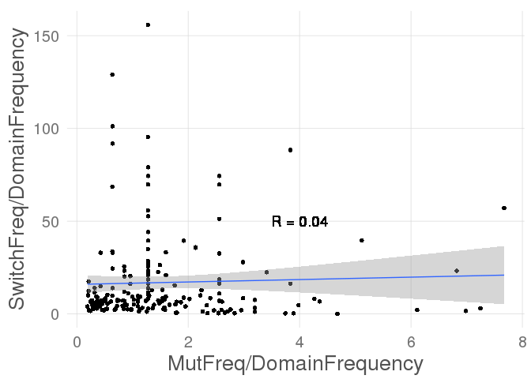

| Domain                                                  |  adjp\_mut|  adjp\_swt|
|:--------------------------------------------------------|----------:|----------:|
| PS51420 - RHO small GTPase Rho family profile.          |          0|      0.000|
| PF00071 - Ras family                                    |          0|      0.000|
| PF07714 - Protein tyrosine kinase                       |          0|      0.000|
| PF00092 - von Willebrand factor type A domain           |          0|      0.000|
| PF01044 - Vinculin family                               |          0|      0.001|
| PF00664 - ABC transporter transmembrane region          |          0|      0.000|
| PF00860 - Permease family                               |          0|      0.000|
| PS50323 - ARG RICH Arginine-rich region profile.        |          0|      0.000|
| PF00155 - Aminotransferase class I and II               |          0|      0.000|
| PF11467 - Lens epithelium-derived growth factor (LEDGF) |          0|      0.000|

hnsc

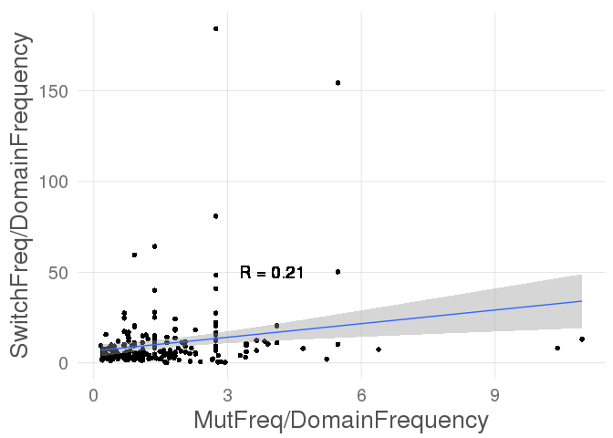

| Domain                                                          |  adjp\_mut|  adjp\_swt|
|:----------------------------------------------------------------|----------:|----------:|
| PF07714 - Protein tyrosine kinase                               |      0.000|      0.000|
| PS51082 - WH2 WH2 domain profile.                               |      0.000|      0.000|
| PF00102 - Protein-tyrosine phosphatase                          |      0.000|      0.000|
| PS51421 - RAS small GTPase Ras family profile.                  |      0.000|      0.021|
| PS51420 - RHO small GTPase Rho family profile.                  |      0.000|      0.000|
| PS50311 - CYS RICH Cysteine-rich region profile.                |      0.000|      0.000|
| PF01044 - Vinculin family                                       |      0.065|      0.000|
| PF05622 - HOOK protein                                          |      0.595|      0.001|
| PF01663 - Type I phosphodiesterase / nucleotide pyrophosphatase |      1.000|      0.000|
| PF06920 - Dedicator of cytokinesis                              |      1.000|      0.000|

kich

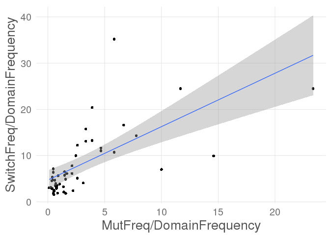

| Domain                                                            |  adjp\_mut|  adjp\_swt|
|:------------------------------------------------------------------|----------:|----------:|
| PF07992 - Pyridine nucleotide-disulphide oxidoreductase           |       0.06|      0.000|
| PF00076 - RNA recognition motif. (a.k.a. RRM, RBD, or RNP domain) |       1.00|      0.000|
| PF01663 - Type I phosphodiesterase / nucleotide pyrophosphatase   |       1.00|      0.050|
| PS50324 - SER RICH Serine-rich region profile.                    |       1.00|      0.000|
| PF00675 - Insulinase (Peptidase family M16)                       |       1.00|      0.000|
| PS50057 - FERM 3 FERM domain profile.                             |       1.00|      0.000|
| PF09286 - Pro-kumamolisin, activation domain                      |       1.00|      0.049|
| PF01044 - Vinculin family                                         |       1.00|      0.000|
| PS51676 - FF FF domain profile.                                   |       1.00|      0.000|
| PF05193 - Peptidase M16 inactive domain                           |       1.00|      0.000|

kirc

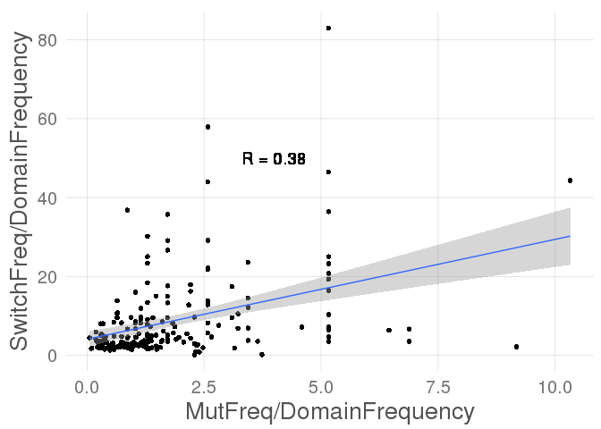

| Domain                                                                            |  adjp\_mut|  adjp\_swt|
|:----------------------------------------------------------------------------------|----------:|----------:|
| PF07714 - Protein tyrosine kinase                                                 |      0.000|          0|
| PF00155 - Aminotransferase class I and II                                         |      0.010|          0|
| PS51082 - WH2 WH2 domain profile.                                                 |      0.111|          0|
| PS50313 - GLU RICH Glutamic acid-rich region profile.                             |      0.538|          0|
| PS50929 - ABC TM1F ABC transporter integral membrane type-1 fused domain profile. |      0.623|          0|
| PF07992 - Pyridine nucleotide-disulphide oxidoreductase                           |      0.784|          0|
| PF12710 - haloacid dehalogenase-like hydrolase                                    |      1.000|          0|
| PS50057 - FERM 3 FERM domain profile.                                             |      1.000|          0|
| PS50311 - CYS RICH Cysteine-rich region profile.                                  |      1.000|          0|
| PF05622 - HOOK protein                                                            |      1.000|          0|

kirp

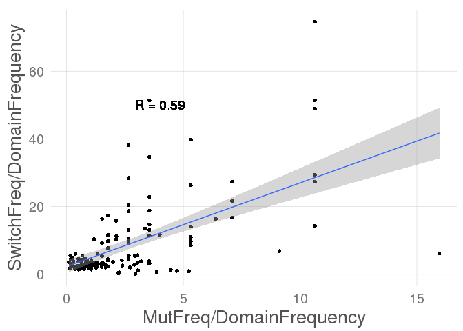

| Domain                                                                             |  adjp\_mut|  adjp\_swt|
|:-----------------------------------------------------------------------------------|----------:|----------:|
| PF00648 - Calpain family cysteine protease                                         |      0.198|      0.000|
| PS50203 - CALPAIN CAT Cysteine proteinase, calpain-type, catalytic domain profile. |      0.198|      0.000|
| PS51420 - RHO small GTPase Rho family profile.                                     |      1.000|      0.000|
| PF01268 - Formate--tetrahydrofolate ligase                                         |      1.000|      0.024|
| PF00092 - von Willebrand factor type A domain                                      |      1.000|      0.000|
| PS50086 - TBC RABGAP TBC/rab GAP domain profile.                                   |      1.000|      0.000|
| PS51082 - WH2 WH2 domain profile.                                                  |      1.000|      0.000|
| PF12775 - P-loop containing dynein motor region D3                                 |      1.000|      0.000|
| PF01401 - Angiotensin-converting enzyme                                            |      1.000|      0.000|
| PF01044 - Vinculin family                                                          |      1.000|      0.000|

lihc

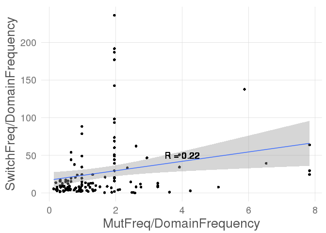

| Domain                                                                          |  adjp\_mut|  adjp\_swt|
|:--------------------------------------------------------------------------------|----------:|----------:|
| PS51421 - RAS small GTPase Ras family profile.                                  |      0.000|      0.000|
| PF00664 - ABC transporter transmembrane region                                  |      0.004|      0.000|
| PF08423 - Rad51                                                                 |      0.013|      0.049|
| PF07888 - Calcium binding and coiled-coil domain (CALCOCO1) like                |      0.021|      0.000|
| PS51420 - RHO small GTPase Rho family profile.                                  |      0.912|      0.000|
| PS50313 - GLU RICH Glutamic acid-rich region profile.                           |      1.000|      0.000|
| PF00405 - Transferrin                                                           |      1.000|      0.003|
| PF00108 - Thiolase, N-terminal domain                                           |      1.000|      0.000|
| PF02390 - Putative methyltransferase                                            |      1.000|      0.000|
| PS51625 - SAM MT TRMB SAM-dependent methyltransferase TRMB-type domain profile. |      1.000|      0.000|

luad

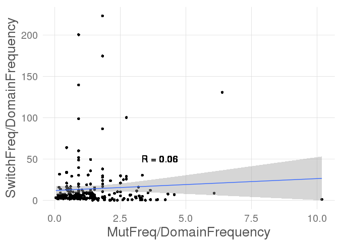

| Domain                                         |  adjp\_mut|  adjp\_swt|
|:-----------------------------------------------|----------:|----------:|
| PS51420 - RHO small GTPase Rho family profile. |          0|      0.000|
| PF00071 - Ras family                           |          0|      0.000|
| PS50835 - IG LIKE Ig-like domain profile.      |          0|      0.000|
| PF00102 - Protein-tyrosine phosphatase         |          0|      0.000|
| PF00176 - SNF2 family N-terminal domain        |          0|      0.000|
| PF07690 - Major Facilitator Superfamily        |          0|      0.002|
| PF00664 - ABC transporter transmembrane region |          0|      0.000|
| PF00155 - Aminotransferase class I and II      |          0|      0.000|
| PF00685 - Sulfotransferase domain              |          0|      0.000|
| PF02181 - Formin Homology 2 Domain             |          0|      0.000|

lusc

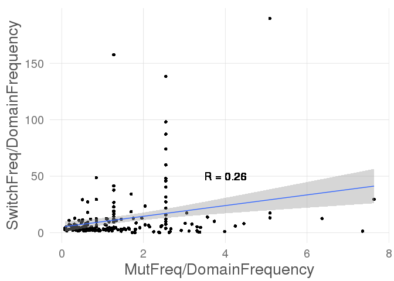

| Domain                                                                         |  adjp\_mut|  adjp\_swt|
|:-------------------------------------------------------------------------------|----------:|----------:|
| PS50835 - IG LIKE Ig-like domain profile.                                      |      0.000|          0|
| PF00155 - Aminotransferase class I and II                                      |      0.000|          0|
| PS51420 - RHO small GTPase Rho family profile.                                 |      0.000|          0|
| PF00176 - SNF2 family N-terminal domain                                        |      0.000|          0|
| PF00685 - Sulfotransferase domain                                              |      0.001|          0|
| PF00102 - Protein-tyrosine phosphatase                                         |      0.002|          0|
| PS50188 - B302 SPRY B30.2/SPRY domain profile.                                 |      0.074|          0|
| PS50261 - G PROTEIN RECEP F2 4 G-protein coupled receptors family 2 profile 2. |      0.212|          0|
| PF02181 - Formin Homology 2 Domain                                             |      0.936|          0|
| PF12026 - Domain of unknown function (DUF3513)                                 |      0.938|          0|

prad

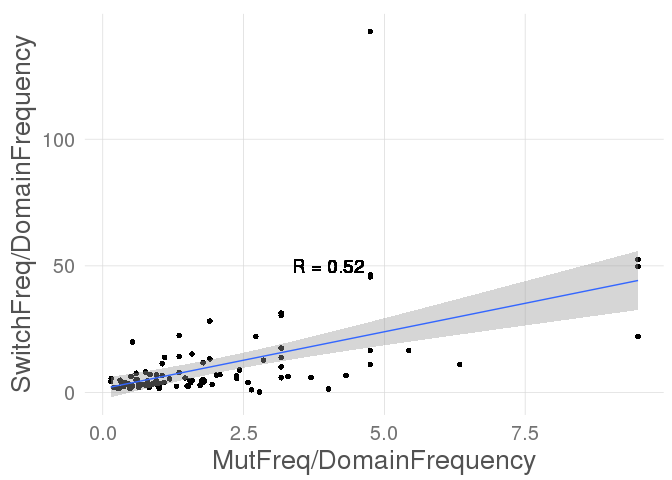

| Domain                                                          |  adjp\_mut|  adjp\_swt|
|:----------------------------------------------------------------|----------:|----------:|
| PS01179 - PID Phosphotyrosine interaction domain (PID) profile. |      0.459|          0|
| PS51421 - RAS small GTPase Ras family profile.                  |      0.728|          0|
| PS50323 - ARG RICH Arginine-rich region profile.                |      1.000|          0|
| PS50311 - CYS RICH Cysteine-rich region profile.                |      1.000|          0|
| PF00640 - Phosphotyrosine interaction domain (PTB/PID)          |      1.000|          0|
| PF00149 - Calcineurin-like phosphoesterase                      |      1.000|          0|
| PS51420 - RHO small GTPase Rho family profile.                  |      1.000|          0|
| PS51082 - WH2 WH2 domain profile.                               |      1.000|          0|
| PS50315 - GLY RICH Glycine-rich region profile.                 |      1.000|          0|
| PF01154 - Hydroxymethylglutaryl-coenzyme A synthase N terminal  |      1.000|          0|

thca

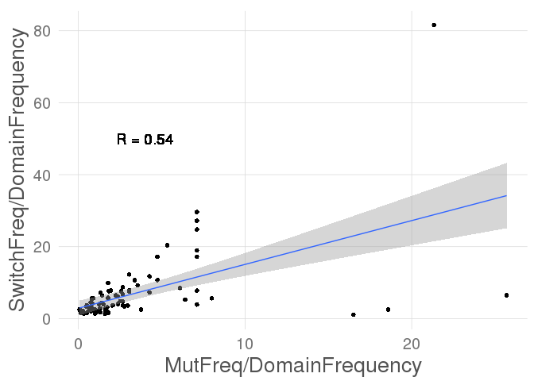

| Domain                                                                            |  adjp\_mut|  adjp\_swt|
|:----------------------------------------------------------------------------------|----------:|----------:|
| PS51420 - RHO small GTPase Rho family profile.                                    |          0|      0.000|
| PS51421 - RAS small GTPase Ras family profile.                                    |          0|      0.000|
| PF00082 - Subtilase family                                                        |          1|      0.000|
| PF03028 - Dynein heavy chain and region D6 of dynein motor                        |          1|      0.000|
| PS51433 - PNT Pointed (PNT) domain profile.                                       |          1|      0.000|
| PF05193 - Peptidase M16 inactive domain                                           |          1|      0.000|
| PF00566 - Rab-GTPase-TBC domain                                                   |          1|      0.000|
| PS50929 - ABC TM1F ABC transporter integral membrane type-1 fused domain profile. |          1|      0.000|
| PS50313 - GLU RICH Glutamic acid-rich region profile.                             |          1|      0.024|
| PS50255 - CYTOCHROME B5 2 Cytochrome b5 family, heme-binding domain profile.      |          1|      0.000|

Kinase domains are frequently mutated, but not that frequently switched, except in some cases (PF07714-Protein tyrosine kinase)

TO-DO
-----

We want to be able to rank domains based on mutations, and to know if that is possible.

1.  The normalization by domain frequency might not be correct
